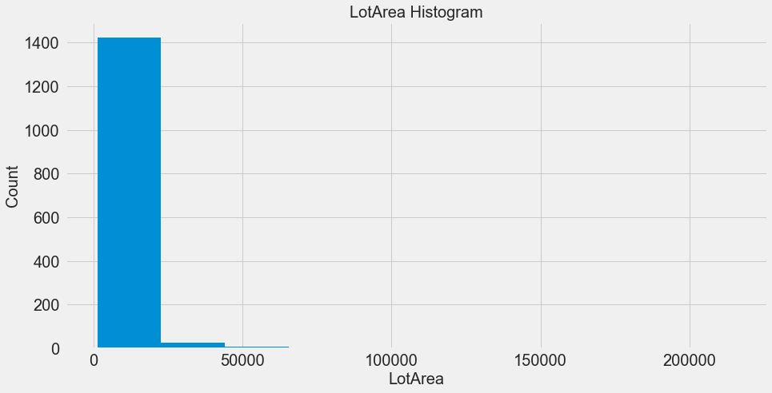
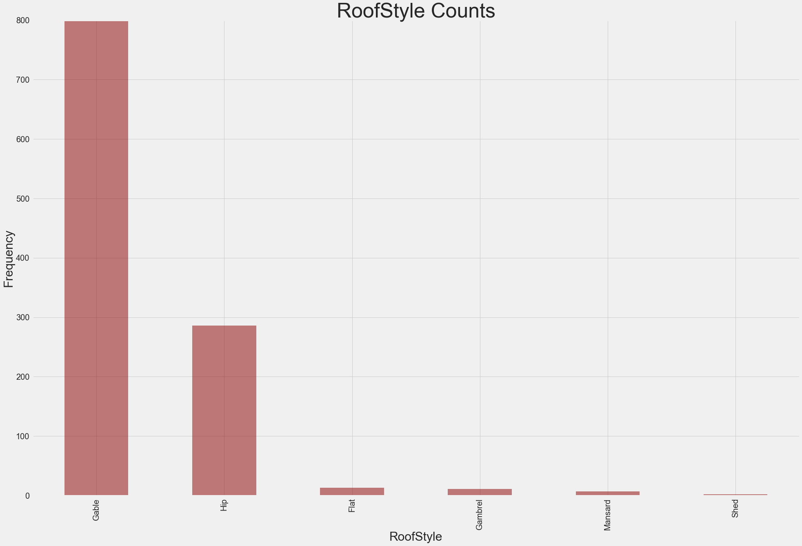
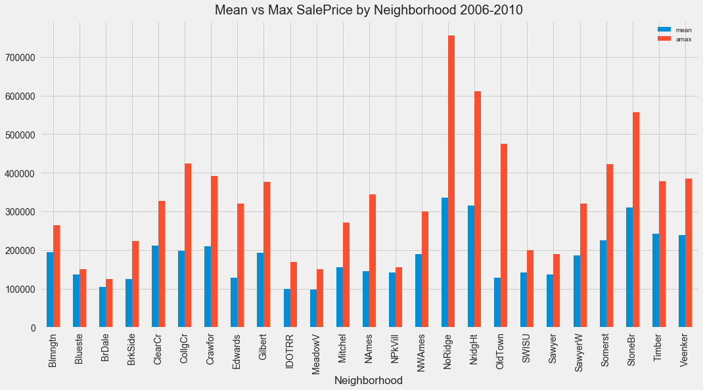
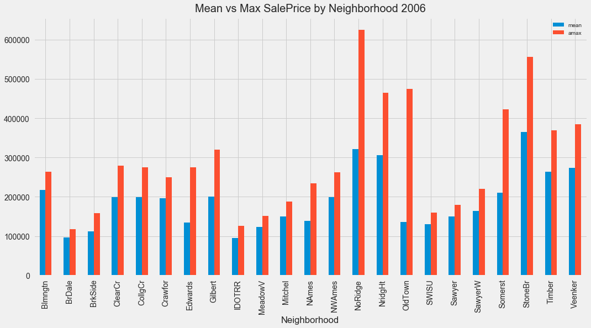
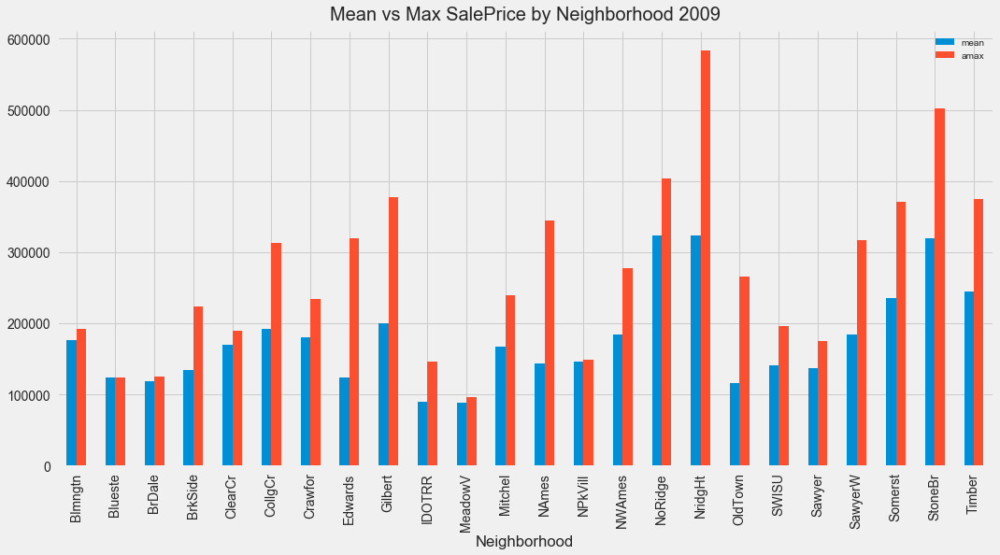

# Project 3: Home Price Analysis

## Charles Macintosh     4-6-17

## Tasks:
* Create a linear regression model

* Executive summary write-up based on the project outline

### Project Outline:
* Identify Problem
    - problem statement
    - describe goals
* Acquire Data
    - kaggle data set (https://www.kaggle.com/c/house-prices-advanced-regression-techniques/data)
    - subset only
* Explore data
    - import using Pandas
    - exploratory analysis with visualization and stat analysis
    - state risks and assumptions
* Mine data
    - create necessary columns
    - format, clean, slice, combine data
* Refine data
    - determine outliers, skew distribution of important variables
    - determine correlations
    - validate findings using statistical analysis (p-values, confidence intervals)
* Build model
    - Linear regression model using scikit learn or statsmodels and interpret findings
    - Calc and plot predicted probabilities and or present tables of results
    - Evaluate model by using loss functions, including absolute mean error, MSE, and root MSE or R2
* Present results
    - Create Jupyter writeup that provides overview with visualizations, statistical analysis,
    data cleaning methods and models
    - Create writeup on interpretation of findings including executive summary with conclusions and next steps
    - Can be in notebook or blog post
* Recommend additional data to be included

##  ANALYSIS 1:
* Where are the most sales taking place?
* Where the most expensive houses are located?
* Is this changing over time?

## ANALYSIS 2:
* Build model to predict house prices
* Provide analysis of neighborhoods to answer their question
* Provide any other insights from the data that you think are important (what other relationships exist?)


### USE ONLY THESE VARIABLES:
* Lot.Area
* Utilities
* Neighborhood
* Bldg.Type
* House.Style
* Overall.Qual
* Overall.Cond
* Year.Built
* Year.Remod.Add
* Roof.Style
* Roof.Matl
* Gr.Liv.Area 
* Full.Bath 
* Half.Bath 
* Bedroom.AbvGr 
* Kitchen.AbvGr 
* Yr.Sold 
* SalePrice 

### IMPORT NECESSARY LIBRARIES


```python
import pandas as pd
import numpy as np

from scipy.stats import stats

import matplotlib.pyplot as plt
import seaborn as sns
%matplotlib inline
plt.style.use('fivethirtyeight')

from sklearn.model_selection import train_test_split
from sklearn.linear_model import LinearRegression
from sklearn.linear_model import Ridge
from sklearn.linear_model import Lasso
from sklearn.preprocessing import MinMaxScaler
from sklearn import linear_model
from sklearn.metrics import r2_score, mean_squared_error
```

### READ RAW DATA FILE / CREATE DATAFRAME & EXAMINE


```python
# read in the raw data file 'train.csv'
df = pd.read_csv('train.csv')
```

* Summary of datafile
* What is numeric (int/float) and what needs to be converted?


```python
df.info()
```

    <class 'pandas.core.frame.DataFrame'>
    RangeIndex: 1460 entries, 0 to 1459
    Data columns (total 81 columns):
    Id               1460 non-null int64
    MSSubClass       1460 non-null int64
    MSZoning         1460 non-null object
    LotFrontage      1201 non-null float64
    LotArea          1460 non-null int64
    Street           1460 non-null object
    Alley            91 non-null object
    LotShape         1460 non-null object
    LandContour      1460 non-null object
    Utilities        1460 non-null object
    LotConfig        1460 non-null object
    LandSlope        1460 non-null object
    Neighborhood     1460 non-null object
    Condition1       1460 non-null object
    Condition2       1460 non-null object
    BldgType         1460 non-null object
    HouseStyle       1460 non-null object
    OverallQual      1460 non-null int64
    OverallCond      1460 non-null int64
    YearBuilt        1460 non-null int64
    YearRemodAdd     1460 non-null int64
    RoofStyle        1460 non-null object
    RoofMatl         1460 non-null object
    Exterior1st      1460 non-null object
    Exterior2nd      1460 non-null object
    MasVnrType       1452 non-null object
    MasVnrArea       1452 non-null float64
    ExterQual        1460 non-null object
    ExterCond        1460 non-null object
    Foundation       1460 non-null object
    BsmtQual         1423 non-null object
    BsmtCond         1423 non-null object
    BsmtExposure     1422 non-null object
    BsmtFinType1     1423 non-null object
    BsmtFinSF1       1460 non-null int64
    BsmtFinType2     1422 non-null object
    BsmtFinSF2       1460 non-null int64
    BsmtUnfSF        1460 non-null int64
    TotalBsmtSF      1460 non-null int64
    Heating          1460 non-null object
    HeatingQC        1460 non-null object
    CentralAir       1460 non-null object
    Electrical       1459 non-null object
    1stFlrSF         1460 non-null int64
    2ndFlrSF         1460 non-null int64
    LowQualFinSF     1460 non-null int64
    GrLivArea        1460 non-null int64
    BsmtFullBath     1460 non-null int64
    BsmtHalfBath     1460 non-null int64
    FullBath         1460 non-null int64
    HalfBath         1460 non-null int64
    BedroomAbvGr     1460 non-null int64
    KitchenAbvGr     1460 non-null int64
    KitchenQual      1460 non-null object
    TotRmsAbvGrd     1460 non-null int64
    Functional       1460 non-null object
    Fireplaces       1460 non-null int64
    FireplaceQu      770 non-null object
    GarageType       1379 non-null object
    GarageYrBlt      1379 non-null float64
    GarageFinish     1379 non-null object
    GarageCars       1460 non-null int64
    GarageArea       1460 non-null int64
    GarageQual       1379 non-null object
    GarageCond       1379 non-null object
    PavedDrive       1460 non-null object
    WoodDeckSF       1460 non-null int64
    OpenPorchSF      1460 non-null int64
    EnclosedPorch    1460 non-null int64
    3SsnPorch        1460 non-null int64
    ScreenPorch      1460 non-null int64
    PoolArea         1460 non-null int64
    PoolQC           7 non-null object
    Fence            281 non-null object
    MiscFeature      54 non-null object
    MiscVal          1460 non-null int64
    MoSold           1460 non-null int64
    YrSold           1460 non-null int64
    SaleType         1460 non-null object
    SaleCondition    1460 non-null object
    SalePrice        1460 non-null int64
    dtypes: float64(3), int64(35), object(43)
    memory usage: 924.0+ KB


### Datafile has 1,460 rows, 81 columns


```python
df.describe()
```


<div>
<table border="1" class="dataframe">
  <thead>
    <tr style="text-align: right;">
      <th></th>
      <th>Id</th>
      <th>MSSubClass</th>
      <th>LotFrontage</th>
      <th>LotArea</th>
      <th>OverallQual</th>
      <th>OverallCond</th>
      <th>YearBuilt</th>
      <th>YearRemodAdd</th>
      <th>MasVnrArea</th>
      <th>BsmtFinSF1</th>
      <th>...</th>
      <th>WoodDeckSF</th>
      <th>OpenPorchSF</th>
      <th>EnclosedPorch</th>
      <th>3SsnPorch</th>
      <th>ScreenPorch</th>
      <th>PoolArea</th>
      <th>MiscVal</th>
      <th>MoSold</th>
      <th>YrSold</th>
      <th>SalePrice</th>
    </tr>
  </thead>
  <tbody>
    <tr>
      <th>count</th>
      <td>1460.000000</td>
      <td>1460.000000</td>
      <td>1201.000000</td>
      <td>1460.000000</td>
      <td>1460.000000</td>
      <td>1460.000000</td>
      <td>1460.000000</td>
      <td>1460.000000</td>
      <td>1452.000000</td>
      <td>1460.000000</td>
      <td>...</td>
      <td>1460.000000</td>
      <td>1460.000000</td>
      <td>1460.000000</td>
      <td>1460.000000</td>
      <td>1460.000000</td>
      <td>1460.000000</td>
      <td>1460.000000</td>
      <td>1460.000000</td>
      <td>1460.000000</td>
      <td>1460.000000</td>
    </tr>
    <tr>
      <th>mean</th>
      <td>730.500000</td>
      <td>56.897260</td>
      <td>70.049958</td>
      <td>10516.828082</td>
      <td>6.099315</td>
      <td>5.575342</td>
      <td>1971.267808</td>
      <td>1984.865753</td>
      <td>103.685262</td>
      <td>443.639726</td>
      <td>...</td>
      <td>94.244521</td>
      <td>46.660274</td>
      <td>21.954110</td>
      <td>3.409589</td>
      <td>15.060959</td>
      <td>2.758904</td>
      <td>43.489041</td>
      <td>6.321918</td>
      <td>2007.815753</td>
      <td>180921.195890</td>
    </tr>
    <tr>
      <th>std</th>
      <td>421.610009</td>
      <td>42.300571</td>
      <td>24.284752</td>
      <td>9981.264932</td>
      <td>1.382997</td>
      <td>1.112799</td>
      <td>30.202904</td>
      <td>20.645407</td>
      <td>181.066207</td>
      <td>456.098091</td>
      <td>...</td>
      <td>125.338794</td>
      <td>66.256028</td>
      <td>61.119149</td>
      <td>29.317331</td>
      <td>55.757415</td>
      <td>40.177307</td>
      <td>496.123024</td>
      <td>2.703626</td>
      <td>1.328095</td>
      <td>79442.502883</td>
    </tr>
    <tr>
      <th>min</th>
      <td>1.000000</td>
      <td>20.000000</td>
      <td>21.000000</td>
      <td>1300.000000</td>
      <td>1.000000</td>
      <td>1.000000</td>
      <td>1872.000000</td>
      <td>1950.000000</td>
      <td>0.000000</td>
      <td>0.000000</td>
      <td>...</td>
      <td>0.000000</td>
      <td>0.000000</td>
      <td>0.000000</td>
      <td>0.000000</td>
      <td>0.000000</td>
      <td>0.000000</td>
      <td>0.000000</td>
      <td>1.000000</td>
      <td>2006.000000</td>
      <td>34900.000000</td>
    </tr>
    <tr>
      <th>25%</th>
      <td>365.750000</td>
      <td>20.000000</td>
      <td>59.000000</td>
      <td>7553.500000</td>
      <td>5.000000</td>
      <td>5.000000</td>
      <td>1954.000000</td>
      <td>1967.000000</td>
      <td>0.000000</td>
      <td>0.000000</td>
      <td>...</td>
      <td>0.000000</td>
      <td>0.000000</td>
      <td>0.000000</td>
      <td>0.000000</td>
      <td>0.000000</td>
      <td>0.000000</td>
      <td>0.000000</td>
      <td>5.000000</td>
      <td>2007.000000</td>
      <td>129975.000000</td>
    </tr>
    <tr>
      <th>50%</th>
      <td>730.500000</td>
      <td>50.000000</td>
      <td>69.000000</td>
      <td>9478.500000</td>
      <td>6.000000</td>
      <td>5.000000</td>
      <td>1973.000000</td>
      <td>1994.000000</td>
      <td>0.000000</td>
      <td>383.500000</td>
      <td>...</td>
      <td>0.000000</td>
      <td>25.000000</td>
      <td>0.000000</td>
      <td>0.000000</td>
      <td>0.000000</td>
      <td>0.000000</td>
      <td>0.000000</td>
      <td>6.000000</td>
      <td>2008.000000</td>
      <td>163000.000000</td>
    </tr>
    <tr>
      <th>75%</th>
      <td>1095.250000</td>
      <td>70.000000</td>
      <td>80.000000</td>
      <td>11601.500000</td>
      <td>7.000000</td>
      <td>6.000000</td>
      <td>2000.000000</td>
      <td>2004.000000</td>
      <td>166.000000</td>
      <td>712.250000</td>
      <td>...</td>
      <td>168.000000</td>
      <td>68.000000</td>
      <td>0.000000</td>
      <td>0.000000</td>
      <td>0.000000</td>
      <td>0.000000</td>
      <td>0.000000</td>
      <td>8.000000</td>
      <td>2009.000000</td>
      <td>214000.000000</td>
    </tr>
    <tr>
      <th>max</th>
      <td>1460.000000</td>
      <td>190.000000</td>
      <td>313.000000</td>
      <td>215245.000000</td>
      <td>10.000000</td>
      <td>9.000000</td>
      <td>2010.000000</td>
      <td>2010.000000</td>
      <td>1600.000000</td>
      <td>5644.000000</td>
      <td>...</td>
      <td>857.000000</td>
      <td>547.000000</td>
      <td>552.000000</td>
      <td>508.000000</td>
      <td>480.000000</td>
      <td>738.000000</td>
      <td>15500.000000</td>
      <td>12.000000</td>
      <td>2010.000000</td>
      <td>755000.000000</td>
    </tr>
  </tbody>
</table>
<p>8 rows × 38 columns</p>
</div>


* ** Only 38/81 columns are numeric and appear in df.describe**
* ** Before cleaning anything, however, need to select only the relevant variables/columns as described above**
* ** Only using 18 columns**

## CREATE NEW DATAFRAME DX, USING THE REQUIRED COLUMNS (#18) FROM DF
- Need to convert several columns from object to numeric values 
- Check to see if any null values/need to impute any values


```python
## Only using 18/821 data columns! 
mac_test= ['LotArea',
'Utilities',
'Neighborhood',
'BldgType',
'HouseStyle',
'OverallQual',
'OverallCond',
'YearBuilt',
'YearRemodAdd',
'RoofStyle',
'RoofMatl',
'GrLivArea',
'FullBath',
'HalfBath',
'BedroomAbvGr',
'KitchenAbvGr',
'YrSold',
'SalePrice']
```


```python
##CONVERTING TO NEW DATAFRAME
dx= df[mac_test]
```

## Quick Histogram analysis of all (numeric) variables in DataSet


```python
# Reduced scope of non-numeric columns 
dx.info()
```

    <class 'pandas.core.frame.DataFrame'>
    RangeIndex: 1460 entries, 0 to 1459
    Data columns (total 18 columns):
    LotArea         1460 non-null int64
    Utilities       1460 non-null object
    Neighborhood    1460 non-null object
    BldgType        1460 non-null object
    HouseStyle      1460 non-null object
    OverallQual     1460 non-null int64
    OverallCond     1460 non-null int64
    YearBuilt       1460 non-null int64
    YearRemodAdd    1460 non-null int64
    RoofStyle       1460 non-null object
    RoofMatl        1460 non-null object
    GrLivArea       1460 non-null int64
    FullBath        1460 non-null int64
    HalfBath        1460 non-null int64
    BedroomAbvGr    1460 non-null int64
    KitchenAbvGr    1460 non-null int64
    YrSold          1460 non-null int64
    SalePrice       1460 non-null int64
    dtypes: int64(12), object(6)
    memory usage: 205.4+ KB


### Data Visualization: Quick Histograms of all Variables (Numeric)


```python
dx.hist(figsize= (30,22));
```


```python
#Check shape of dx
dx.shape
```


    (1460, 17)


```python
dx.head()
```


<div>
<table border="1" class="dataframe">
  <thead>
    <tr style="text-align: right;">
      <th></th>
      <th>LotArea</th>
      <th>Utilities</th>
      <th>Neighborhood</th>
      <th>BldgType</th>
      <th>HouseStyle</th>
      <th>OverallQual</th>
      <th>OverallCond</th>
      <th>YearBuilt</th>
      <th>YearRemodAdd</th>
      <th>RoofStyle</th>
      <th>RoofMatl</th>
      <th>GrLivArea</th>
      <th>FullBath</th>
      <th>HalfBath</th>
      <th>BedroomAbvGr</th>
      <th>KitchenAbvGr</th>
      <th>YrSold</th>
      <th>SalePrice</th>
    </tr>
  </thead>
  <tbody>
    <tr>
      <th>0</th>
      <td>8450</td>
      <td>AllPub</td>
      <td>CollgCr</td>
      <td>1Fam</td>
      <td>2Story</td>
      <td>7</td>
      <td>5</td>
      <td>2003</td>
      <td>2003</td>
      <td>Gable</td>
      <td>CompShg</td>
      <td>1710</td>
      <td>2</td>
      <td>1</td>
      <td>3</td>
      <td>1</td>
      <td>2008</td>
      <td>208500</td>
    </tr>
    <tr>
      <th>1</th>
      <td>9600</td>
      <td>AllPub</td>
      <td>Veenker</td>
      <td>1Fam</td>
      <td>1Story</td>
      <td>6</td>
      <td>8</td>
      <td>1976</td>
      <td>1976</td>
      <td>Gable</td>
      <td>CompShg</td>
      <td>1262</td>
      <td>2</td>
      <td>0</td>
      <td>3</td>
      <td>1</td>
      <td>2007</td>
      <td>181500</td>
    </tr>
    <tr>
      <th>2</th>
      <td>11250</td>
      <td>AllPub</td>
      <td>CollgCr</td>
      <td>1Fam</td>
      <td>2Story</td>
      <td>7</td>
      <td>5</td>
      <td>2001</td>
      <td>2002</td>
      <td>Gable</td>
      <td>CompShg</td>
      <td>1786</td>
      <td>2</td>
      <td>1</td>
      <td>3</td>
      <td>1</td>
      <td>2008</td>
      <td>223500</td>
    </tr>
    <tr>
      <th>3</th>
      <td>9550</td>
      <td>AllPub</td>
      <td>Crawfor</td>
      <td>1Fam</td>
      <td>2Story</td>
      <td>7</td>
      <td>5</td>
      <td>1915</td>
      <td>1970</td>
      <td>Gable</td>
      <td>CompShg</td>
      <td>1717</td>
      <td>1</td>
      <td>0</td>
      <td>3</td>
      <td>1</td>
      <td>2006</td>
      <td>140000</td>
    </tr>
    <tr>
      <th>4</th>
      <td>14260</td>
      <td>AllPub</td>
      <td>NoRidge</td>
      <td>1Fam</td>
      <td>2Story</td>
      <td>8</td>
      <td>5</td>
      <td>2000</td>
      <td>2000</td>
      <td>Gable</td>
      <td>CompShg</td>
      <td>2198</td>
      <td>2</td>
      <td>1</td>
      <td>4</td>
      <td>1</td>
      <td>2008</td>
      <td>250000</td>
    </tr>
  </tbody>
</table>
</div>


## CHECK NULL VALUES BY COLUMN
- Doesn't seem to have any null values


```python
dx.isnull().sum()
```


    LotArea         0
    Utilities       0
    Neighborhood    0
    BldgType        0
    HouseStyle      0
    OverallQual     0
    OverallCond     0
    YearBuilt       0
    YearRemodAdd    0
    RoofStyle       0
    RoofMatl        0
    GrLivArea       0
    FullBath        0
    HalfBath        0
    BedroomAbvGr    0
    KitchenAbvGr    0
    YrSold          0
    SalePrice       0
    dtype: int64


### Convert/dummify data
- dx.describe only populated 12 variables; 6 variables need to be either converted to numeric or dummified
- Need to dummify several variables like Utilities, Neighborhood, BldgType, RoofStyle, HouseStyle, Roofmatl

### Need to normalize the data
- Some things like OverallQual and OverallCond are on a scale 1-10
- YearRemodAdd and YrSold are years
- FullBath, HalfBath, BedroomAbvGr, KitchenAbvGr are all small values-- ranging from 0 to 8, with most between 0 and 2

### Data Cleaning steps:
- max/min, z-score
- relabel
- decode
- recast
- handle null values
- binarize (dummy values), drop those <1% of data
- drop outliers, >3stdevs
- discretization
 


## EXAMINE  18 columns/variables 
### What needs to be cleansed/converted/dropped?

* LotArea: object, convert or dummify
* Utilities: object, convert or dummify
* Neighborhood: object, convert or dummify
* BldgType: object, convert or dummify
* HouseStyle: object, convert or dummify
* OverallQuality:  range 1-10
* OverallCondition: range 1-9
* YearBuilt: range 1872-2010
* YearRemodAdd: range 1950-2010
* RoofStyle: object, convert or dummify
* RoofMatl: object, convert or dummify
* GrLivArea: range 334-5642, stdev: 525, might want to drop outliers?
* FullBath: range 0-3, need to normalize
* HalfBath: range 0-2, need to normalize
* BedroomAbvGr: range 0-8, need to normalize
* KitchenAbvGr: range 0-3, need to normalize
* YrSold: range 2006-2010, use this to select test/train data! 
* SalePrice: range 34,900 to 755,000

### Eleven columns are already Numeric
* Need to scale/normalize

### Six columns need to be converted from Object to Numeric:
* Dummify variables/drop outliers


- 1) Utilities
- 2) Neighborhood
- 3) BldgType
- 4) HouseStyle
- 5) RoofStyle
- 6) RoofMatl

### CONVERSION OF COLUMNS FROM OBJECT TO NUMERIC:

### 1- Utilities
* Utilities is not numeric, needs to be converted
* Upon closer inspection, however, looks like there are only 2 unique values:  AllPub and NoSeWa
* All but one instance are AllPub, so proposing ignoring/dropping the one instance of NoSeWa-- change it to AllPub


```python
dx['Utilities'].value_counts()
```


    AllPub    1459
    NoSeWa       1
    Name: Utilities, dtype: int64


```python
# replace NoSeWa with AllPub
dx['Utilities']= dx['Utilities'].apply(lambda x: 'AllPub' if x=='NoSeWa' else x)
```

    /Users/charlesmacintosh/anaconda/lib/python2.7/site-packages/ipykernel/__main__.py:2: SettingWithCopyWarning: 
    A value is trying to be set on a copy of a slice from a DataFrame.
    Try using .loc[row_indexer,col_indexer] = value instead
    
    See the caveats in the documentation: http://pandas.pydata.org/pandas-docs/stable/indexing.html#indexing-view-versus-copy
      from ipykernel import kernelapp as app


```python
#CONFIRM ALL VALUES NOW 'ALLPUB'
dx['Utilities'].value_counts()
```


    AllPub    1460
    Name: Utilities, dtype: int64


```python
dx['Utilities'].describe()
```


    count       1460
    unique         1
    top       AllPub
    freq        1460
    Name: Utilities, dtype: object


```python
dx.head(1)
```


<div>
<table border="1" class="dataframe">
  <thead>
    <tr style="text-align: right;">
      <th></th>
      <th>LotArea</th>
      <th>Utilities</th>
      <th>Neighborhood</th>
      <th>BldgType</th>
      <th>HouseStyle</th>
      <th>OverallQual</th>
      <th>OverallCond</th>
      <th>YearBuilt</th>
      <th>YearRemodAdd</th>
      <th>RoofStyle</th>
      <th>RoofMatl</th>
      <th>GrLivArea</th>
      <th>FullBath</th>
      <th>HalfBath</th>
      <th>BedroomAbvGr</th>
      <th>KitchenAbvGr</th>
      <th>YrSold</th>
      <th>SalePrice</th>
    </tr>
  </thead>
  <tbody>
    <tr>
      <th>0</th>
      <td>8450</td>
      <td>AllPub</td>
      <td>CollgCr</td>
      <td>1Fam</td>
      <td>2Story</td>
      <td>7</td>
      <td>5</td>
      <td>2003</td>
      <td>2003</td>
      <td>Gable</td>
      <td>CompShg</td>
      <td>1710</td>
      <td>2</td>
      <td>1</td>
      <td>3</td>
      <td>1</td>
      <td>2008</td>
      <td>208500</td>
    </tr>
  </tbody>
</table>
</div>


```python
dx.columns[1]
```


    'Utilities'


**DROP column 'Utilities' as it is only one variable output 'AllPub' for all 1460 rows in the Dataset**
* Frankly should have done this immediately instead of replacing value and then deleting...


```python
# drop 'Utilities'
dx= dx.drop(dx.columns[1], axis =1)
```


```python
dx.shape
```


    (1460, 17)


```python
# NOTE 'Utilities' is now gone
dx.head(5)
```


<div>
<table border="1" class="dataframe">
  <thead>
    <tr style="text-align: right;">
      <th></th>
      <th>LotArea</th>
      <th>Neighborhood</th>
      <th>BldgType</th>
      <th>HouseStyle</th>
      <th>OverallQual</th>
      <th>OverallCond</th>
      <th>YearBuilt</th>
      <th>YearRemodAdd</th>
      <th>RoofStyle</th>
      <th>RoofMatl</th>
      <th>GrLivArea</th>
      <th>FullBath</th>
      <th>HalfBath</th>
      <th>BedroomAbvGr</th>
      <th>KitchenAbvGr</th>
      <th>YrSold</th>
      <th>SalePrice</th>
    </tr>
  </thead>
  <tbody>
    <tr>
      <th>0</th>
      <td>8450</td>
      <td>CollgCr</td>
      <td>1Fam</td>
      <td>2Story</td>
      <td>7</td>
      <td>5</td>
      <td>2003</td>
      <td>2003</td>
      <td>Gable</td>
      <td>CompShg</td>
      <td>1710</td>
      <td>2</td>
      <td>1</td>
      <td>3</td>
      <td>1</td>
      <td>2008</td>
      <td>208500</td>
    </tr>
    <tr>
      <th>1</th>
      <td>9600</td>
      <td>Veenker</td>
      <td>1Fam</td>
      <td>1Story</td>
      <td>6</td>
      <td>8</td>
      <td>1976</td>
      <td>1976</td>
      <td>Gable</td>
      <td>CompShg</td>
      <td>1262</td>
      <td>2</td>
      <td>0</td>
      <td>3</td>
      <td>1</td>
      <td>2007</td>
      <td>181500</td>
    </tr>
    <tr>
      <th>2</th>
      <td>11250</td>
      <td>CollgCr</td>
      <td>1Fam</td>
      <td>2Story</td>
      <td>7</td>
      <td>5</td>
      <td>2001</td>
      <td>2002</td>
      <td>Gable</td>
      <td>CompShg</td>
      <td>1786</td>
      <td>2</td>
      <td>1</td>
      <td>3</td>
      <td>1</td>
      <td>2008</td>
      <td>223500</td>
    </tr>
    <tr>
      <th>3</th>
      <td>9550</td>
      <td>Crawfor</td>
      <td>1Fam</td>
      <td>2Story</td>
      <td>7</td>
      <td>5</td>
      <td>1915</td>
      <td>1970</td>
      <td>Gable</td>
      <td>CompShg</td>
      <td>1717</td>
      <td>1</td>
      <td>0</td>
      <td>3</td>
      <td>1</td>
      <td>2006</td>
      <td>140000</td>
    </tr>
    <tr>
      <th>4</th>
      <td>14260</td>
      <td>NoRidge</td>
      <td>1Fam</td>
      <td>2Story</td>
      <td>8</td>
      <td>5</td>
      <td>2000</td>
      <td>2000</td>
      <td>Gable</td>
      <td>CompShg</td>
      <td>2198</td>
      <td>2</td>
      <td>1</td>
      <td>4</td>
      <td>1</td>
      <td>2008</td>
      <td>250000</td>
    </tr>
  </tbody>
</table>
</div>


### 2- Neighborhood
* 25 unique values, ranging in frequency from 2 to 225


```python
dx['Neighborhood'].describe()
```


    count      1460
    unique       25
    top       NAmes
    freq        225
    Name: Neighborhood, dtype: object


### DATA VISUALIZATION :  Salesprice by Neighborhood (BoxPlots)


```python
##BOX PLOT OF SALEPRICE DISTRIBUTION BY NEIGHBORHOOD
plt.subplots(figsize=(15,8))
counter = 0
plots=[]
for i in dx.Neighborhood.unique():
    plots.append(dx[dx['Neighborhood']==i]['SalePrice'])
    counter += 1
#plots.
plt.boxplot(plots, autorange= True)
plt.xticks(range(1,dx.Neighborhood.nunique()+1),dx.Neighborhood.unique(), rotation=90, fontsize=20, color = 'blue')
plt.yticks( fontsize=20)
plt.title("SalePrice distribution by Neighborhood", fontsize=20)
plt.show();
```


## Salescount by Neighborhood
* NAmes led with 225 sales, 15.4% by volume


```python
# NAmes led with 225 sales in the dataset (Boston 2006-2010)
# 15.4% of sales by unit count/volume
sales_count= dx['Neighborhood'].value_counts()
dj= sales_count.to_frame()
dj['Market Share by Count']= dj['Neighborhood']/sales_count.sum()
dj
```


<div>
<table border="1" class="dataframe">
  <thead>
    <tr style="text-align: right;">
      <th></th>
      <th>Neighborhood</th>
      <th>Market Share by Count</th>
    </tr>
  </thead>
  <tbody>
    <tr>
      <th>NAmes</th>
      <td>225</td>
      <td>0.154110</td>
    </tr>
    <tr>
      <th>CollgCr</th>
      <td>150</td>
      <td>0.102740</td>
    </tr>
    <tr>
      <th>OldTown</th>
      <td>113</td>
      <td>0.077397</td>
    </tr>
    <tr>
      <th>Edwards</th>
      <td>100</td>
      <td>0.068493</td>
    </tr>
    <tr>
      <th>Somerst</th>
      <td>86</td>
      <td>0.058904</td>
    </tr>
    <tr>
      <th>Gilbert</th>
      <td>79</td>
      <td>0.054110</td>
    </tr>
    <tr>
      <th>NridgHt</th>
      <td>77</td>
      <td>0.052740</td>
    </tr>
    <tr>
      <th>Sawyer</th>
      <td>74</td>
      <td>0.050685</td>
    </tr>
    <tr>
      <th>NWAmes</th>
      <td>73</td>
      <td>0.050000</td>
    </tr>
    <tr>
      <th>SawyerW</th>
      <td>59</td>
      <td>0.040411</td>
    </tr>
    <tr>
      <th>BrkSide</th>
      <td>58</td>
      <td>0.039726</td>
    </tr>
    <tr>
      <th>Crawfor</th>
      <td>51</td>
      <td>0.034932</td>
    </tr>
    <tr>
      <th>Mitchel</th>
      <td>49</td>
      <td>0.033562</td>
    </tr>
    <tr>
      <th>NoRidge</th>
      <td>41</td>
      <td>0.028082</td>
    </tr>
    <tr>
      <th>Timber</th>
      <td>38</td>
      <td>0.026027</td>
    </tr>
    <tr>
      <th>IDOTRR</th>
      <td>37</td>
      <td>0.025342</td>
    </tr>
    <tr>
      <th>ClearCr</th>
      <td>28</td>
      <td>0.019178</td>
    </tr>
    <tr>
      <th>SWISU</th>
      <td>25</td>
      <td>0.017123</td>
    </tr>
    <tr>
      <th>StoneBr</th>
      <td>25</td>
      <td>0.017123</td>
    </tr>
    <tr>
      <th>MeadowV</th>
      <td>17</td>
      <td>0.011644</td>
    </tr>
    <tr>
      <th>Blmngtn</th>
      <td>17</td>
      <td>0.011644</td>
    </tr>
    <tr>
      <th>BrDale</th>
      <td>16</td>
      <td>0.010959</td>
    </tr>
    <tr>
      <th>Veenker</th>
      <td>11</td>
      <td>0.007534</td>
    </tr>
    <tr>
      <th>NPkVill</th>
      <td>9</td>
      <td>0.006164</td>
    </tr>
    <tr>
      <th>Blueste</th>
      <td>2</td>
      <td>0.001370</td>
    </tr>
  </tbody>
</table>
</div>


```python
hoods=[]
maxvalues=[]
dates=[]
for n in dx['Neighborhood']:
        if n not in hoods:
            Years= [2006, 2007, 2008, 2009, 2010] 
            for i in Years:
                a= dx.loc[(dx['Neighborhood'] == n)& (dx['YrSold'] == i)].max()
                maxvalues.append(a.SalePrice)
                hoods.append(n)
                dates.append(i)
##HOW DO I PUT THIS IN DATAFRAME??
##WANT TO PLOT IT
```

# ANALYSIS 1.1:  WHICH NEIGHBORHOOD HAS MOST SALES?
* Can see from bar chart below that most sales occur in NAmes
* Also see same result using pivotable analysis


```python
##PLOT BY NEIGHBORHOOD SALES FREQUENCY
plt.style.use('fivethirtyeight')
neighborhood_frequency = dx.Neighborhood.value_counts().to_frame()
ax = neighborhood_frequency.plot(kind='bar', legend=False, grid=True, alpha=0.5, 
                         color='darkred', figsize=(30,20))
plt.title('Neighborhood Sales Count', fontsize=50)
plt.ylim([0,110])
plt.yticks((0, 10, 20, 30, 40, 60, 80, 100, 125, 150, 200, 250), fontsize=30)
plt.ylabel('Frequency', fontsize=30)
plt.xlabel('Neighborhood', fontsize=30)
plt.xticks(fontsize=30)
plt.show();
```


```python
# Plot number of sales by Neighborhood
hood_df = pd.DataFrame(dx['Neighborhood'].value_counts()).reset_index()
hood_df.columns = ['Neighborhood', 'SalesCount']
hood_df.plot(kind='barh', x='Neighborhood', y='SalesCount', legend = False, color = 'red', figsize= (10,10));
```


## Get same answer with pivot table:  'NAmes' leads all neighborhoods with  225 sales


```python
nb_df= pd.pivot_table(dx,values= 'SalePrice', index= 'Neighborhood', aggfunc= len).copy()
nb_df.sort_values(ascending=False, inplace=True)
```


```python
nb_df
```


    Neighborhood
    NAmes      225
    CollgCr    150
    OldTown    113
    Edwards    100
    Somerst     86
    Gilbert     79
    NridgHt     77
    Sawyer      74
    NWAmes      73
    SawyerW     59
    BrkSide     58
    Crawfor     51
    Mitchel     49
    NoRidge     41
    Timber      38
    IDOTRR      37
    ClearCr     28
    SWISU       25
    StoneBr     25
    Blmngtn     17
    MeadowV     17
    BrDale      16
    Veenker     11
    NPkVill      9
    Blueste      2
    Name: SalePrice, dtype: int64


```python
nb_df.max()
```


    225


```python
#YET ANOTHER WAY USING IDXMAX()
pd.pivot_table(dx,values= 'SalePrice', index= 'Neighborhood', aggfunc= len).idxmax()
```


    'NAmes'


## ANALYSIS 1.2: Where are the most expensive sales? 
* Using pivot table and visualization 'NoRidge' has the most expensive sales, across mean/min/max methods


```python
nb2= pd.pivot_table(dx,values= 'SalePrice', index= 'Neighborhood', aggfunc= [max, np.mean, min])
nb2
```


<div>
<table border="1" class="dataframe">
  <thead>
    <tr style="text-align: right;">
      <th></th>
      <th>max</th>
      <th>mean</th>
      <th>min</th>
    </tr>
    <tr>
      <th>Neighborhood</th>
      <th></th>
      <th></th>
      <th></th>
    </tr>
  </thead>
  <tbody>
    <tr>
      <th>Blmngtn</th>
      <td>264561</td>
      <td>194870</td>
      <td>159895</td>
    </tr>
    <tr>
      <th>Blueste</th>
      <td>151000</td>
      <td>137500</td>
      <td>124000</td>
    </tr>
    <tr>
      <th>BrDale</th>
      <td>125000</td>
      <td>104493</td>
      <td>83000</td>
    </tr>
    <tr>
      <th>BrkSide</th>
      <td>223500</td>
      <td>124834</td>
      <td>39300</td>
    </tr>
    <tr>
      <th>ClearCr</th>
      <td>328000</td>
      <td>212565</td>
      <td>130000</td>
    </tr>
    <tr>
      <th>CollgCr</th>
      <td>424870</td>
      <td>197965</td>
      <td>110000</td>
    </tr>
    <tr>
      <th>Crawfor</th>
      <td>392500</td>
      <td>210624</td>
      <td>90350</td>
    </tr>
    <tr>
      <th>Edwards</th>
      <td>320000</td>
      <td>128219</td>
      <td>58500</td>
    </tr>
    <tr>
      <th>Gilbert</th>
      <td>377500</td>
      <td>192854</td>
      <td>141000</td>
    </tr>
    <tr>
      <th>IDOTRR</th>
      <td>169500</td>
      <td>100123</td>
      <td>34900</td>
    </tr>
    <tr>
      <th>MeadowV</th>
      <td>151400</td>
      <td>98576</td>
      <td>75000</td>
    </tr>
    <tr>
      <th>Mitchel</th>
      <td>271000</td>
      <td>156270</td>
      <td>84500</td>
    </tr>
    <tr>
      <th>NAmes</th>
      <td>345000</td>
      <td>145847</td>
      <td>87500</td>
    </tr>
    <tr>
      <th>NPkVill</th>
      <td>155000</td>
      <td>142694</td>
      <td>127500</td>
    </tr>
    <tr>
      <th>NWAmes</th>
      <td>299800</td>
      <td>189050</td>
      <td>82500</td>
    </tr>
    <tr>
      <th>NoRidge</th>
      <td>755000</td>
      <td>335295</td>
      <td>190000</td>
    </tr>
    <tr>
      <th>NridgHt</th>
      <td>611657</td>
      <td>316270</td>
      <td>154000</td>
    </tr>
    <tr>
      <th>OldTown</th>
      <td>475000</td>
      <td>128225</td>
      <td>37900</td>
    </tr>
    <tr>
      <th>SWISU</th>
      <td>200000</td>
      <td>142591</td>
      <td>60000</td>
    </tr>
    <tr>
      <th>Sawyer</th>
      <td>190000</td>
      <td>136793</td>
      <td>62383</td>
    </tr>
    <tr>
      <th>SawyerW</th>
      <td>320000</td>
      <td>186555</td>
      <td>76000</td>
    </tr>
    <tr>
      <th>Somerst</th>
      <td>423000</td>
      <td>225379</td>
      <td>144152</td>
    </tr>
    <tr>
      <th>StoneBr</th>
      <td>556581</td>
      <td>310499</td>
      <td>170000</td>
    </tr>
    <tr>
      <th>Timber</th>
      <td>378500</td>
      <td>242247</td>
      <td>137500</td>
    </tr>
    <tr>
      <th>Veenker</th>
      <td>385000</td>
      <td>238772</td>
      <td>162500</td>
    </tr>
  </tbody>
</table>
</div>


```python
nb2.idxmax()
```


    max     NoRidge
    mean    NoRidge
    min     NoRidge
    dtype: object


```python
##PLOT BY NEIGHBORHOOD SALES MAX & MIN PRICE
plt.style.use('fivethirtyeight')

ax = nb2.plot(kind='bar', legend=True, grid=True, alpha=0.5, 
                         color=('darkred', 'blue', 'orange'), figsize=(30,20))

plt.title('Neighborhood Sales Price', fontsize=50)
plt.ylim([0,110])
plt.yticks((0, 100000, 200000, 400000, 600000, 700000, 800000), fontsize=20)
plt.ylabel('Price', fontsize=30)
plt.xlabel('Neighborhood', fontsize=30)

plt.xticks(fontsize=20)
plt.show();
```


## ANALYSIS 1.3:  Most expensive neighborhoods over time?


```python
# PIVOT TABLE ALL YEARS
yr_count= pd.pivot_table(dx, values=['SalePrice'], index=['YrSold'], aggfunc=[np.mean, max])
yr_count
```


<div>
<table border="1" class="dataframe">
  <thead>
    <tr>
      <th></th>
      <th>mean</th>
      <th>max</th>
    </tr>
    <tr>
      <th></th>
      <th>SalePrice</th>
      <th>SalePrice</th>
    </tr>
    <tr>
      <th>YrSold</th>
      <th></th>
      <th></th>
    </tr>
  </thead>
  <tbody>
    <tr>
      <th>2006</th>
      <td>182549</td>
      <td>625000</td>
    </tr>
    <tr>
      <th>2007</th>
      <td>186063</td>
      <td>755000</td>
    </tr>
    <tr>
      <th>2008</th>
      <td>177360</td>
      <td>446261</td>
    </tr>
    <tr>
      <th>2009</th>
      <td>179432</td>
      <td>582933</td>
    </tr>
    <tr>
      <th>2010</th>
      <td>177393</td>
      <td>611657</td>
    </tr>
  </tbody>
</table>
</div>


```python
#Plot the change in  price by year
yr_count.plot();
```


```python
# MAX for 2006
H_06= pd.pivot_table(dx[dx['YrSold']==2006], values='SalePrice', index=['Neighborhood'], aggfunc=[np.mean]).idxmax()[0]
N_06=pd.pivot_table(dx[dx['YrSold']==2006], values='SalePrice', index=['Neighborhood'], aggfunc=[np.mean]).max()[0]
```


```python
# MAX for 2007
H_07=pd.pivot_table(dx[dx['YrSold']==2007], values='SalePrice', index=['Neighborhood'], aggfunc=[np.mean]).idxmax()[0]
N_07=pd.pivot_table(dx[dx['YrSold']==2007], values='SalePrice', index=['Neighborhood'], aggfunc=[np.mean]).max()[0]
```


```python
# MAX for 2008
H_08=pd.pivot_table(dx[dx['YrSold']==2008], values='SalePrice', index=['Neighborhood'], aggfunc=[np.mean]).idxmax()[0]
N_08=pd.pivot_table(dx[dx['YrSold']==2008], values='SalePrice', index=['Neighborhood'], aggfunc=[np.mean]).max()[0]
```


```python
# MAX for 2009
H_09=pd.pivot_table(dx[dx['YrSold']==2009], values='SalePrice', index=['Neighborhood'], aggfunc=[np.mean]).idxmax()[0]
N_09=pd.pivot_table(dx[dx['YrSold']==2009], values='SalePrice', index=['Neighborhood'], aggfunc=[np.mean]).max()[0]
```


```python
# MAX for 2010
H_10=pd.pivot_table(dx[dx['YrSold']==2010], values='SalePrice', index=['Neighborhood'], aggfunc=[np.mean]).idxmax()[0]
N_10=pd.pivot_table(dx[dx['YrSold']==2010], values='SalePrice', index=['Neighborhood'], aggfunc=[np.mean]).max()[0]
```


```python
HOOD_LIST=[H_06, H_07, H_08, H_09, H_10]
NUMB_LIST=[N_06, N_07, N_08, N_09, N_10]
```


```python
HOOD_LIST
```


    ['StoneBr', 'NoRidge', 'NridgHt', 'NoRidge', 'StoneBr']


```python
NUMB_LIST
```


    [365046, 399730, 332422, 323875, 318886]


```python
Years
```


    [2006, 2007, 2008, 2009, 2010]


```python
zip(HOOD_LIST,NUMB_LIST, Years)
```


    [('StoneBr', 365046, 2006),
     ('NoRidge', 399730, 2007),
     ('NridgHt', 332422, 2008),
     ('NoRidge', 323875, 2009),
     ('StoneBr', 318886, 2010)]


### Most expensive neighborhood (by average sale price) has changed from 2006-2010
* Not easy to parse that from pivot table or plot above, so broke out specifics below using pivottables
* Used mean price by year and returned the idxmax (Neighborhood) and max (SalePrice) values
* Interestingly the max sales price dropped each year from 2006 to 2010, by nearly 20%, reflecting the aftermath of the housing crisis, the 'most expensive' (by Max price) changed every year


```python
# calculate summary statistics by Neighborhood/Year - NOT EASY TO SEE WHO IS HIGHEST IN ANY GIVEN YEAR   
pd.pivot_table(dx, index=['Neighborhood','YrSold'],values=['SalePrice'],aggfunc=[np.mean,max, min, len])               
```


<div>
<table border="1" class="dataframe">
  <thead>
    <tr>
      <th></th>
      <th></th>
      <th>mean</th>
      <th>max</th>
      <th>min</th>
      <th>len</th>
    </tr>
    <tr>
      <th></th>
      <th></th>
      <th>SalePrice</th>
      <th>SalePrice</th>
      <th>SalePrice</th>
      <th>SalePrice</th>
    </tr>
    <tr>
      <th>Neighborhood</th>
      <th>YrSold</th>
      <th></th>
      <th></th>
      <th></th>
      <th></th>
    </tr>
  </thead>
  <tbody>
    <tr>
      <th rowspan="5" valign="top">Blmngtn</th>
      <th>2006</th>
      <td>217087</td>
      <td>264561</td>
      <td>167240</td>
      <td>7</td>
    </tr>
    <tr>
      <th>2007</th>
      <td>183350</td>
      <td>194201</td>
      <td>172500</td>
      <td>2</td>
    </tr>
    <tr>
      <th>2008</th>
      <td>175447</td>
      <td>191000</td>
      <td>159895</td>
      <td>2</td>
    </tr>
    <tr>
      <th>2009</th>
      <td>176720</td>
      <td>192500</td>
      <td>160200</td>
      <td>5</td>
    </tr>
    <tr>
      <th>2010</th>
      <td>192000</td>
      <td>192000</td>
      <td>192000</td>
      <td>1</td>
    </tr>
    <tr>
      <th rowspan="2" valign="top">Blueste</th>
      <th>2008</th>
      <td>151000</td>
      <td>151000</td>
      <td>151000</td>
      <td>1</td>
    </tr>
    <tr>
      <th>2009</th>
      <td>124000</td>
      <td>124000</td>
      <td>124000</td>
      <td>1</td>
    </tr>
    <tr>
      <th rowspan="5" valign="top">BrDale</th>
      <th>2006</th>
      <td>96750</td>
      <td>118000</td>
      <td>83000</td>
      <td>4</td>
    </tr>
    <tr>
      <th>2007</th>
      <td>113833</td>
      <td>122500</td>
      <td>106000</td>
      <td>3</td>
    </tr>
    <tr>
      <th>2008</th>
      <td>95225</td>
      <td>106000</td>
      <td>85400</td>
      <td>4</td>
    </tr>
    <tr>
      <th>2009</th>
      <td>118625</td>
      <td>125000</td>
      <td>112000</td>
      <td>4</td>
    </tr>
    <tr>
      <th>2010</th>
      <td>88000</td>
      <td>88000</td>
      <td>88000</td>
      <td>1</td>
    </tr>
    <tr>
      <th rowspan="5" valign="top">BrkSide</th>
      <th>2006</th>
      <td>112746</td>
      <td>159000</td>
      <td>79900</td>
      <td>15</td>
    </tr>
    <tr>
      <th>2007</th>
      <td>135737</td>
      <td>210000</td>
      <td>39300</td>
      <td>10</td>
    </tr>
    <tr>
      <th>2008</th>
      <td>121707</td>
      <td>207000</td>
      <td>52000</td>
      <td>14</td>
    </tr>
    <tr>
      <th>2009</th>
      <td>134994</td>
      <td>223500</td>
      <td>60000</td>
      <td>17</td>
    </tr>
    <tr>
      <th>2010</th>
      <td>96500</td>
      <td>116500</td>
      <td>76500</td>
      <td>2</td>
    </tr>
    <tr>
      <th rowspan="5" valign="top">ClearCr</th>
      <th>2006</th>
      <td>199166</td>
      <td>280000</td>
      <td>130000</td>
      <td>6</td>
    </tr>
    <tr>
      <th>2007</th>
      <td>236333</td>
      <td>302000</td>
      <td>187500</td>
      <td>6</td>
    </tr>
    <tr>
      <th>2008</th>
      <td>208991</td>
      <td>256000</td>
      <td>134432</td>
      <td>8</td>
    </tr>
    <tr>
      <th>2009</th>
      <td>169875</td>
      <td>190000</td>
      <td>143000</td>
      <td>4</td>
    </tr>
    <tr>
      <th>2010</th>
      <td>246850</td>
      <td>328000</td>
      <td>155000</td>
      <td>4</td>
    </tr>
    <tr>
      <th rowspan="5" valign="top">CollgCr</th>
      <th>2006</th>
      <td>199016</td>
      <td>275000</td>
      <td>128500</td>
      <td>32</td>
    </tr>
    <tr>
      <th>2007</th>
      <td>213999</td>
      <td>424870</td>
      <td>112500</td>
      <td>30</td>
    </tr>
    <tr>
      <th>2008</th>
      <td>187718</td>
      <td>287000</td>
      <td>110000</td>
      <td>36</td>
    </tr>
    <tr>
      <th>2009</th>
      <td>192317</td>
      <td>313000</td>
      <td>123000</td>
      <td>39</td>
    </tr>
    <tr>
      <th>2010</th>
      <td>203700</td>
      <td>272000</td>
      <td>128200</td>
      <td>13</td>
    </tr>
    <tr>
      <th rowspan="3" valign="top">Crawfor</th>
      <th>2006</th>
      <td>196635</td>
      <td>250000</td>
      <td>137500</td>
      <td>11</td>
    </tr>
    <tr>
      <th>2007</th>
      <td>198777</td>
      <td>359100</td>
      <td>90350</td>
      <td>19</td>
    </tr>
    <tr>
      <th>2008</th>
      <td>254411</td>
      <td>392500</td>
      <td>149000</td>
      <td>9</td>
    </tr>
    <tr>
      <th>...</th>
      <th>...</th>
      <td>...</td>
      <td>...</td>
      <td>...</td>
      <td>...</td>
    </tr>
    <tr>
      <th rowspan="2" valign="top">SWISU</th>
      <th>2009</th>
      <td>141048</td>
      <td>197000</td>
      <td>60000</td>
      <td>8</td>
    </tr>
    <tr>
      <th>2010</th>
      <td>141333</td>
      <td>169000</td>
      <td>127000</td>
      <td>3</td>
    </tr>
    <tr>
      <th rowspan="5" valign="top">Sawyer</th>
      <th>2006</th>
      <td>149735</td>
      <td>180000</td>
      <td>90000</td>
      <td>17</td>
    </tr>
    <tr>
      <th>2007</th>
      <td>133935</td>
      <td>190000</td>
      <td>108000</td>
      <td>17</td>
    </tr>
    <tr>
      <th>2008</th>
      <td>128900</td>
      <td>165000</td>
      <td>80000</td>
      <td>13</td>
    </tr>
    <tr>
      <th>2009</th>
      <td>136925</td>
      <td>175000</td>
      <td>62383</td>
      <td>11</td>
    </tr>
    <tr>
      <th>2010</th>
      <td>132400</td>
      <td>158900</td>
      <td>94000</td>
      <td>16</td>
    </tr>
    <tr>
      <th rowspan="5" valign="top">SawyerW</th>
      <th>2006</th>
      <td>164787</td>
      <td>220000</td>
      <td>107000</td>
      <td>8</td>
    </tr>
    <tr>
      <th>2007</th>
      <td>209300</td>
      <td>301000</td>
      <td>144000</td>
      <td>12</td>
    </tr>
    <tr>
      <th>2008</th>
      <td>184080</td>
      <td>262280</td>
      <td>141000</td>
      <td>11</td>
    </tr>
    <tr>
      <th>2009</th>
      <td>183934</td>
      <td>316600</td>
      <td>76000</td>
      <td>15</td>
    </tr>
    <tr>
      <th>2010</th>
      <td>184076</td>
      <td>320000</td>
      <td>99500</td>
      <td>13</td>
    </tr>
    <tr>
      <th rowspan="5" valign="top">Somerst</th>
      <th>2006</th>
      <td>210268</td>
      <td>423000</td>
      <td>144152</td>
      <td>16</td>
    </tr>
    <tr>
      <th>2007</th>
      <td>233248</td>
      <td>340000</td>
      <td>147000</td>
      <td>24</td>
    </tr>
    <tr>
      <th>2008</th>
      <td>225631</td>
      <td>339750</td>
      <td>146000</td>
      <td>20</td>
    </tr>
    <tr>
      <th>2009</th>
      <td>236315</td>
      <td>370878</td>
      <td>164500</td>
      <td>18</td>
    </tr>
    <tr>
      <th>2010</th>
      <td>206762</td>
      <td>262500</td>
      <td>151000</td>
      <td>8</td>
    </tr>
    <tr>
      <th rowspan="5" valign="top">StoneBr</th>
      <th>2006</th>
      <td>365046</td>
      <td>556581</td>
      <td>239000</td>
      <td>6</td>
    </tr>
    <tr>
      <th>2007</th>
      <td>279585</td>
      <td>392000</td>
      <td>170000</td>
      <td>5</td>
    </tr>
    <tr>
      <th>2008</th>
      <td>245000</td>
      <td>325000</td>
      <td>180000</td>
      <td>4</td>
    </tr>
    <tr>
      <th>2009</th>
      <td>319967</td>
      <td>501837</td>
      <td>187500</td>
      <td>5</td>
    </tr>
    <tr>
      <th>2010</th>
      <td>318886</td>
      <td>538000</td>
      <td>212000</td>
      <td>5</td>
    </tr>
    <tr>
      <th rowspan="5" valign="top">Timber</th>
      <th>2006</th>
      <td>264485</td>
      <td>369900</td>
      <td>176000</td>
      <td>7</td>
    </tr>
    <tr>
      <th>2007</th>
      <td>229470</td>
      <td>283463</td>
      <td>170000</td>
      <td>11</td>
    </tr>
    <tr>
      <th>2008</th>
      <td>234361</td>
      <td>305000</td>
      <td>167500</td>
      <td>7</td>
    </tr>
    <tr>
      <th>2009</th>
      <td>245437</td>
      <td>375000</td>
      <td>137500</td>
      <td>8</td>
    </tr>
    <tr>
      <th>2010</th>
      <td>245160</td>
      <td>378500</td>
      <td>160000</td>
      <td>5</td>
    </tr>
    <tr>
      <th rowspan="3" valign="top">Veenker</th>
      <th>2006</th>
      <td>273333</td>
      <td>385000</td>
      <td>165000</td>
      <td>3</td>
    </tr>
    <tr>
      <th>2007</th>
      <td>214900</td>
      <td>294000</td>
      <td>181500</td>
      <td>5</td>
    </tr>
    <tr>
      <th>2008</th>
      <td>244000</td>
      <td>324000</td>
      <td>162500</td>
      <td>3</td>
    </tr>
  </tbody>
</table>
<p>119 rows × 4 columns</p>
</div>


### 3- Building Type has 5 unique values, ideal for dummification


```python
#Building Type
dx['BldgType'].describe()
```


    count     1460
    unique       5
    top       1Fam
    freq      1220
    Name: BldgType, dtype: object


```python
dx['BldgType'].value_counts()
```


    1Fam      1220
    TwnhsE     114
    Duplex      52
    Twnhs       43
    2fmCon      31
    Name: BldgType, dtype: int64


### 4- HouseStyle has 8 unique values
* Dummify


```python
#House Style
dx['HouseStyle'].describe()
```


    count       1460
    unique         8
    top       1Story
    freq         726
    Name: HouseStyle, dtype: object


```python
dx['HouseStyle'].value_counts()
```


    1Story    726
    2Story    445
    1.5Fin    154
    SLvl       65
    SFoyer     37
    1.5Unf     14
    2.5Unf     11
    2.5Fin      8
    Name: HouseStyle, dtype: int64


### 5- RoofStyle has 6 unique values
* Nearly 75% are 'Gable'
* Dummify?


```python
dx['RoofStyle'].describe()
```


    count      1460
    unique        6
    top       Gable
    freq       1141
    Name: RoofStyle, dtype: object


```python
dx['RoofStyle'].value_counts()
```


    Gable      1141
    Hip         286
    Flat         13
    Gambrel      11
    Mansard       7
    Shed          2
    Name: RoofStyle, dtype: int64


### 6- RoofMatl has 8 unique values
* Vast majority are CompShg (1434/1460)
* Dummify?


```python
dx['RoofMatl'].describe()
```


    count        1460
    unique          8
    top       CompShg
    freq         1434
    Name: RoofMatl, dtype: object


```python
dx['RoofMatl'].value_counts()
```


    CompShg    1434
    Tar&Grv      11
    WdShngl       6
    WdShake       5
    Membran       1
    Metal         1
    ClyTile       1
    Roll          1
    Name: RoofMatl, dtype: int64


# DATA VISUALIZATION OF VARIABLES


```python
#Histogram SalePrice; 50 bins. Positive skew of 1.9
plt.hist(dx['SalePrice'],bins=50);
dx['SalePrice'].skew()
```


    1.8828757597682129


```python
# PLOT HISTOGRAM LOT AREA
plt.subplots(figsize=(14,7))
dx['LotArea'].hist()
plt.title('LotArea Histogram', fontsize=20)
plt.xticks(fontsize=20)
plt.yticks(fontsize=20)
plt.xlabel("LotArea",fontsize=20)
plt.ylabel("Count",fontsize=20);
```





```python
# FREQUENCY OF HOUSESTYLE COUNTS
plt.style.use('fivethirtyeight')

housestyle_frequency = dx.HouseStyle.value_counts().to_frame()
ax = housestyle_frequency.plot(kind='bar', legend=False, grid=True, alpha=0.5, 
                         color='darkred', figsize=(30,20))

plt.title('HouseStyle Counts', fontsize=50)
plt.ylim([0,110])
plt.yticks((0,100, 200, 300, 400, 500, 600, 700, 800), fontsize=20)
plt.ylabel('Frequency', fontsize=30)
plt.xlabel('HouseStyle', fontsize=30)

plt.xticks(fontsize=20)
plt.show();
```


```python
# FREQUENCY OF ROOFSTYLE COUNTS
plt.style.use('fivethirtyeight')

roofstyle_frequency = dx.RoofStyle.value_counts().to_frame()
ax = roofstyle_frequency.plot(kind='bar', legend=False, grid=True, alpha=0.5, 
                         color='darkred', figsize=(30,20))

plt.title('RoofStyle Counts', fontsize=50)
plt.ylim([0,110])
plt.yticks((0,100, 200, 300, 400, 500, 600, 700, 800), fontsize=20)
plt.ylabel('Frequency', fontsize=30)
plt.xlabel('RoofStyle', fontsize=30)

plt.xticks(fontsize=20)
plt.show();
```





### DATA VISUALIZATION: Violin Plots of dummy variables


```python
# VIOLIN PLOTS OF VARIABLES
sns.violinplot(x="Neighborhood", y="SalePrice", data=dx)
plt.show()
sns.violinplot(x="BldgType", y="SalePrice", data=dx)
plt.show()
sns.violinplot(x="HouseStyle", y="SalePrice", data=dx)
plt.show()
sns.violinplot(x="RoofStyle", y="SalePrice", data=dx)
plt.show()
sns.violinplot(x="RoofMatl", y="SalePrice", data=dx)
plt.show()
```


### DATA VISUALIZATION: Sales Price by HouseStyle (Mean/Median/Max)


```python
# SALES PRICE BAR CHARTS
# Making a bar graph of average vs mean salesprice by HouseStyle
dxp = pd.pivot_table(dx, values='SalePrice', index='HouseStyle', aggfunc=[np.mean, np.median, max])
ax = dxp.plot(kind='bar', figsize=(16,8), fontsize=14)
ax.set_title('Mean vs Median SalePrice by HouseStyle', fontsize=20, y=1.01);
```


### DATA VISUALIZATION: Mean/Max Sales Price by Year by Neighborhood
* Did bar chart for each year (2006-2010) and final chart combines them into one


```python
# SALES PRICE BAR CHARTS - mean vs max salesprice by NeighborHood (ALL YEARS)
dxp = pd.pivot_table(dx, values='SalePrice', index='Neighborhood', aggfunc=[np.mean, np.max])
ax = dxp.plot(kind='bar', figsize=(16,8), fontsize=14)
ax.set_title('Mean vs Max SalePrice by Neighborhood 2006-2010', fontsize=20, y=1.01);
```





```python
# SALES PRICE BAR CHARTS - mean vs max salesprice by NeighborHood (2006)
dxp = pd.pivot_table(dx[dx['YrSold']==2006], values='SalePrice', index='Neighborhood', aggfunc=[np.mean, np.max])
ax = dxp.plot(kind='bar', figsize=(16,8), fontsize=14)
ax.set_title('Mean vs Max SalePrice by Neighborhood 2006', fontsize=20, y=1.01);
```





```python
# SALES PRICE BAR CHARTS - mean vs max salesprice by NeighborHood (2007)
dxp = pd.pivot_table(dx[dx['YrSold']==2007], values='SalePrice', index='Neighborhood', aggfunc=[np.mean, np.max])
ax = dxp.plot(kind='bar', figsize=(16,8), fontsize=14)
ax.set_title('Mean vs Max SalePrice by Neighborhood 2007', fontsize=20, y=1.01);
```


```python
# SALES PRICE BAR CHARTS - mean vs max salesprice by NeighborHood (2008)
dxp = pd.pivot_table(dx[dx['YrSold']==2008], values='SalePrice', index='Neighborhood', aggfunc=[np.mean, np.max])
ax = dxp.plot(kind='bar', figsize=(16,8), fontsize=14)
ax.set_title('Mean vs Max SalePrice by Neighborhood 2008', fontsize=20, y=1.01);
```


```python
# SALES PRICE BAR CHARTS - mean vs max salesprice by NeighborHood (2009)
dxp = pd.pivot_table(dx[dx['YrSold']==2009], values='SalePrice', index='Neighborhood', aggfunc=[np.mean, np.max])
ax = dxp.plot(kind='bar', figsize=(16,8), fontsize=14)
ax.set_title('Mean vs Max SalePrice by Neighborhood 2009', fontsize=20, y=1.01);
```





```python
# SALES PRICE BAR CHARTS - mean vs max salesprice by NeighborHood (2010)
dxp = pd.pivot_table(dx[dx['YrSold']==2010], values='SalePrice', index='Neighborhood', aggfunc=[np.mean, np.max])
ax = dxp.plot(kind='bar', figsize=(16,8), fontsize=14)
ax.set_title('Mean vs Max SalePrice by Neighborhood 2010', fontsize=20, y=1.01);
```


### Data Visualization: Correlation Matrices
* First one is a squared correlation, showing clearly how related 


```python
##CORRELATION MAPv**2 (SQUARED)-- HEAT INDEX 
correl = dx.corr()**2
fig, ax = plt.subplots(figsize=(6,6))
sns.heatmap(correl);
```


```python
##CORRELATION HEATMAP
sns.set(style="white")
corr = dx.corr()
# Generate a mask for the upper triangle
mask = np.zeros_like(corr, dtype=np.bool)
mask[np.triu_indices_from(mask)] = True
# Set up the matplotlib figure
f, ax = plt.subplots(figsize=(11, 9))
# Generate a custom diverging colormap
cmap = sns.diverging_palette(220, 10, as_cmap=True)
# Draw the heatmap with the mask and correct aspect ratio
sns.heatmap(corr, mask=mask, cmap=cmap, vmax=.3,
            square=True, #xticklabels=5, yticklabels=5,
            linewidths=.5, cbar_kws={"shrink": .5}, ax=ax)
plt.show();
```


```python
#CORRELATION MATRIX FOR DATAFRAME
dx.corr()
```


<div>
<table border="1" class="dataframe">
  <thead>
    <tr style="text-align: right;">
      <th></th>
      <th>LotArea</th>
      <th>OverallQual</th>
      <th>OverallCond</th>
      <th>YearBuilt</th>
      <th>YearRemodAdd</th>
      <th>GrLivArea</th>
      <th>FullBath</th>
      <th>HalfBath</th>
      <th>BedroomAbvGr</th>
      <th>KitchenAbvGr</th>
      <th>YrSold</th>
      <th>SalePrice</th>
    </tr>
  </thead>
  <tbody>
    <tr>
      <th>LotArea</th>
      <td>1.000000</td>
      <td>0.105806</td>
      <td>-0.005636</td>
      <td>0.014228</td>
      <td>0.013788</td>
      <td>0.263116</td>
      <td>0.126031</td>
      <td>0.014259</td>
      <td>0.119690</td>
      <td>-0.017784</td>
      <td>-0.014261</td>
      <td>0.263843</td>
    </tr>
    <tr>
      <th>OverallQual</th>
      <td>0.105806</td>
      <td>1.000000</td>
      <td>-0.091932</td>
      <td>0.572323</td>
      <td>0.550684</td>
      <td>0.593007</td>
      <td>0.550600</td>
      <td>0.273458</td>
      <td>0.101676</td>
      <td>-0.183882</td>
      <td>-0.027347</td>
      <td>0.790982</td>
    </tr>
    <tr>
      <th>OverallCond</th>
      <td>-0.005636</td>
      <td>-0.091932</td>
      <td>1.000000</td>
      <td>-0.375983</td>
      <td>0.073741</td>
      <td>-0.079686</td>
      <td>-0.194149</td>
      <td>-0.060769</td>
      <td>0.012980</td>
      <td>-0.087001</td>
      <td>0.043950</td>
      <td>-0.077856</td>
    </tr>
    <tr>
      <th>YearBuilt</th>
      <td>0.014228</td>
      <td>0.572323</td>
      <td>-0.375983</td>
      <td>1.000000</td>
      <td>0.592855</td>
      <td>0.199010</td>
      <td>0.468271</td>
      <td>0.242656</td>
      <td>-0.070651</td>
      <td>-0.174800</td>
      <td>-0.013618</td>
      <td>0.522897</td>
    </tr>
    <tr>
      <th>YearRemodAdd</th>
      <td>0.013788</td>
      <td>0.550684</td>
      <td>0.073741</td>
      <td>0.592855</td>
      <td>1.000000</td>
      <td>0.287389</td>
      <td>0.439046</td>
      <td>0.183331</td>
      <td>-0.040581</td>
      <td>-0.149598</td>
      <td>0.035743</td>
      <td>0.507101</td>
    </tr>
    <tr>
      <th>GrLivArea</th>
      <td>0.263116</td>
      <td>0.593007</td>
      <td>-0.079686</td>
      <td>0.199010</td>
      <td>0.287389</td>
      <td>1.000000</td>
      <td>0.630012</td>
      <td>0.415772</td>
      <td>0.521270</td>
      <td>0.100063</td>
      <td>-0.036526</td>
      <td>0.708624</td>
    </tr>
    <tr>
      <th>FullBath</th>
      <td>0.126031</td>
      <td>0.550600</td>
      <td>-0.194149</td>
      <td>0.468271</td>
      <td>0.439046</td>
      <td>0.630012</td>
      <td>1.000000</td>
      <td>0.136381</td>
      <td>0.363252</td>
      <td>0.133115</td>
      <td>-0.019669</td>
      <td>0.560664</td>
    </tr>
    <tr>
      <th>HalfBath</th>
      <td>0.014259</td>
      <td>0.273458</td>
      <td>-0.060769</td>
      <td>0.242656</td>
      <td>0.183331</td>
      <td>0.415772</td>
      <td>0.136381</td>
      <td>1.000000</td>
      <td>0.226651</td>
      <td>-0.068263</td>
      <td>-0.010269</td>
      <td>0.284108</td>
    </tr>
    <tr>
      <th>BedroomAbvGr</th>
      <td>0.119690</td>
      <td>0.101676</td>
      <td>0.012980</td>
      <td>-0.070651</td>
      <td>-0.040581</td>
      <td>0.521270</td>
      <td>0.363252</td>
      <td>0.226651</td>
      <td>1.000000</td>
      <td>0.198597</td>
      <td>-0.036014</td>
      <td>0.168213</td>
    </tr>
    <tr>
      <th>KitchenAbvGr</th>
      <td>-0.017784</td>
      <td>-0.183882</td>
      <td>-0.087001</td>
      <td>-0.174800</td>
      <td>-0.149598</td>
      <td>0.100063</td>
      <td>0.133115</td>
      <td>-0.068263</td>
      <td>0.198597</td>
      <td>1.000000</td>
      <td>0.031687</td>
      <td>-0.135907</td>
    </tr>
    <tr>
      <th>YrSold</th>
      <td>-0.014261</td>
      <td>-0.027347</td>
      <td>0.043950</td>
      <td>-0.013618</td>
      <td>0.035743</td>
      <td>-0.036526</td>
      <td>-0.019669</td>
      <td>-0.010269</td>
      <td>-0.036014</td>
      <td>0.031687</td>
      <td>1.000000</td>
      <td>-0.028923</td>
    </tr>
    <tr>
      <th>SalePrice</th>
      <td>0.263843</td>
      <td>0.790982</td>
      <td>-0.077856</td>
      <td>0.522897</td>
      <td>0.507101</td>
      <td>0.708624</td>
      <td>0.560664</td>
      <td>0.284108</td>
      <td>0.168213</td>
      <td>-0.135907</td>
      <td>-0.028923</td>
      <td>1.000000</td>
    </tr>
  </tbody>
</table>
</div>


### Data Visualization:  Sales Price Distribution
* Not quiet bell shaped, skewed right


```python
# SalesPrice Distribution 
fig = dx['SalePrice'].hist(figsize=(12,6), color='darkorange')
plt.style.use('fivethirtyeight')

# get the current axis
ax = plt.gca()
ax.set_ylabel('Frequency', fontsize=14)
ax.set_xlabel('SalePrice', fontsize=14)
ax.set_title('SalesPrice Distribution', y=1.01);
```


#### IGNORE  FOLLOWING CHART, CAN'T GET IT TO WORK


```python
# SALES PRICE BAR CHARTS - Mean Salesprice by NeighborHood (2006-2010)
dxp = pd.pivot_table(dx, values='SalePrice', index=['Neighborhood','YrSold'], aggfunc=[np.mean])
ax = dxp.plot(kind='bar', figsize=(16,8), fontsize=10)
ax.set_title('Mean SalePrice by Neighborhood 2006-2010', fontsize=20, y=1.01);
```


# MAKE DUMMY VARIABLES FOR THOSE FIVE OBJECT COLUMNS
* Neighborhood, BldgType, HouseStyte, RoofStyle, RoofMatl
* Dummifying all these columns (not including Utilities as we deleted that column)


```python
###MAKE DUMMIES IN NEW DATASET 'DZ'
categories = ['Neighborhood','BldgType','HouseStyle','RoofStyle','RoofMatl']
for category in categories:
    series = dx[category]
    dummies = pd.get_dummies(series, prefix=category, drop_first=False)
    dx = pd.concat([dx, dummies], axis=1)
print dx.columns
```

    Index([u'LotArea', u'Neighborhood', u'BldgType', u'HouseStyle', u'OverallQual',
           u'OverallCond', u'YearBuilt', u'YearRemodAdd', u'RoofStyle',
           u'RoofMatl', u'GrLivArea', u'FullBath', u'HalfBath', u'BedroomAbvGr',
           u'KitchenAbvGr', u'YrSold', u'SalePrice', u'Neighborhood_Blmngtn',
           u'Neighborhood_Blueste', u'Neighborhood_BrDale',
           u'Neighborhood_BrkSide', u'Neighborhood_ClearCr',
           u'Neighborhood_CollgCr', u'Neighborhood_Crawfor',
           u'Neighborhood_Edwards', u'Neighborhood_Gilbert',
           u'Neighborhood_IDOTRR', u'Neighborhood_MeadowV',
           u'Neighborhood_Mitchel', u'Neighborhood_NAmes', u'Neighborhood_NPkVill',
           u'Neighborhood_NWAmes', u'Neighborhood_NoRidge',
           u'Neighborhood_NridgHt', u'Neighborhood_OldTown', u'Neighborhood_SWISU',
           u'Neighborhood_Sawyer', u'Neighborhood_SawyerW',
           u'Neighborhood_Somerst', u'Neighborhood_StoneBr',
           u'Neighborhood_Timber', u'Neighborhood_Veenker', u'BldgType_1Fam',
           u'BldgType_2fmCon', u'BldgType_Duplex', u'BldgType_Twnhs',
           u'BldgType_TwnhsE', u'HouseStyle_1.5Fin', u'HouseStyle_1.5Unf',
           u'HouseStyle_1Story', u'HouseStyle_2.5Fin', u'HouseStyle_2.5Unf',
           u'HouseStyle_2Story', u'HouseStyle_SFoyer', u'HouseStyle_SLvl',
           u'RoofStyle_Flat', u'RoofStyle_Gable', u'RoofStyle_Gambrel',
           u'RoofStyle_Hip', u'RoofStyle_Mansard', u'RoofStyle_Shed',
           u'RoofMatl_ClyTile', u'RoofMatl_CompShg', u'RoofMatl_Membran',
           u'RoofMatl_Metal', u'RoofMatl_Roll', u'RoofMatl_Tar&Grv',
           u'RoofMatl_WdShake', u'RoofMatl_WdShngl'],
          dtype='object')


```python
dx.Neighborhood.unique()
```


    array(['CollgCr', 'Veenker', 'Crawfor', 'NoRidge', 'Mitchel', 'Somerst',
           'NWAmes', 'OldTown', 'BrkSide', 'Sawyer', 'NridgHt', 'NAmes',
           'SawyerW', 'IDOTRR', 'MeadowV', 'Edwards', 'Timber', 'Gilbert',
           'StoneBr', 'ClearCr', 'NPkVill', 'Blmngtn', 'BrDale', 'SWISU',
           'Blueste'], dtype=object)


```python
dx.head(10)
```


<div>
<table border="1" class="dataframe">
  <thead>
    <tr style="text-align: right;">
      <th></th>
      <th>LotArea</th>
      <th>Neighborhood</th>
      <th>BldgType</th>
      <th>HouseStyle</th>
      <th>OverallQual</th>
      <th>OverallCond</th>
      <th>YearBuilt</th>
      <th>YearRemodAdd</th>
      <th>RoofStyle</th>
      <th>RoofMatl</th>
      <th>...</th>
      <th>RoofStyle_Mansard</th>
      <th>RoofStyle_Shed</th>
      <th>RoofMatl_ClyTile</th>
      <th>RoofMatl_CompShg</th>
      <th>RoofMatl_Membran</th>
      <th>RoofMatl_Metal</th>
      <th>RoofMatl_Roll</th>
      <th>RoofMatl_Tar&amp;Grv</th>
      <th>RoofMatl_WdShake</th>
      <th>RoofMatl_WdShngl</th>
    </tr>
  </thead>
  <tbody>
    <tr>
      <th>0</th>
      <td>8450</td>
      <td>CollgCr</td>
      <td>1Fam</td>
      <td>2Story</td>
      <td>7</td>
      <td>5</td>
      <td>2003</td>
      <td>2003</td>
      <td>Gable</td>
      <td>CompShg</td>
      <td>...</td>
      <td>0</td>
      <td>0</td>
      <td>0</td>
      <td>1</td>
      <td>0</td>
      <td>0</td>
      <td>0</td>
      <td>0</td>
      <td>0</td>
      <td>0</td>
    </tr>
    <tr>
      <th>1</th>
      <td>9600</td>
      <td>Veenker</td>
      <td>1Fam</td>
      <td>1Story</td>
      <td>6</td>
      <td>8</td>
      <td>1976</td>
      <td>1976</td>
      <td>Gable</td>
      <td>CompShg</td>
      <td>...</td>
      <td>0</td>
      <td>0</td>
      <td>0</td>
      <td>1</td>
      <td>0</td>
      <td>0</td>
      <td>0</td>
      <td>0</td>
      <td>0</td>
      <td>0</td>
    </tr>
    <tr>
      <th>2</th>
      <td>11250</td>
      <td>CollgCr</td>
      <td>1Fam</td>
      <td>2Story</td>
      <td>7</td>
      <td>5</td>
      <td>2001</td>
      <td>2002</td>
      <td>Gable</td>
      <td>CompShg</td>
      <td>...</td>
      <td>0</td>
      <td>0</td>
      <td>0</td>
      <td>1</td>
      <td>0</td>
      <td>0</td>
      <td>0</td>
      <td>0</td>
      <td>0</td>
      <td>0</td>
    </tr>
    <tr>
      <th>3</th>
      <td>9550</td>
      <td>Crawfor</td>
      <td>1Fam</td>
      <td>2Story</td>
      <td>7</td>
      <td>5</td>
      <td>1915</td>
      <td>1970</td>
      <td>Gable</td>
      <td>CompShg</td>
      <td>...</td>
      <td>0</td>
      <td>0</td>
      <td>0</td>
      <td>1</td>
      <td>0</td>
      <td>0</td>
      <td>0</td>
      <td>0</td>
      <td>0</td>
      <td>0</td>
    </tr>
    <tr>
      <th>4</th>
      <td>14260</td>
      <td>NoRidge</td>
      <td>1Fam</td>
      <td>2Story</td>
      <td>8</td>
      <td>5</td>
      <td>2000</td>
      <td>2000</td>
      <td>Gable</td>
      <td>CompShg</td>
      <td>...</td>
      <td>0</td>
      <td>0</td>
      <td>0</td>
      <td>1</td>
      <td>0</td>
      <td>0</td>
      <td>0</td>
      <td>0</td>
      <td>0</td>
      <td>0</td>
    </tr>
    <tr>
      <th>5</th>
      <td>14115</td>
      <td>Mitchel</td>
      <td>1Fam</td>
      <td>1.5Fin</td>
      <td>5</td>
      <td>5</td>
      <td>1993</td>
      <td>1995</td>
      <td>Gable</td>
      <td>CompShg</td>
      <td>...</td>
      <td>0</td>
      <td>0</td>
      <td>0</td>
      <td>1</td>
      <td>0</td>
      <td>0</td>
      <td>0</td>
      <td>0</td>
      <td>0</td>
      <td>0</td>
    </tr>
    <tr>
      <th>6</th>
      <td>10084</td>
      <td>Somerst</td>
      <td>1Fam</td>
      <td>1Story</td>
      <td>8</td>
      <td>5</td>
      <td>2004</td>
      <td>2005</td>
      <td>Gable</td>
      <td>CompShg</td>
      <td>...</td>
      <td>0</td>
      <td>0</td>
      <td>0</td>
      <td>1</td>
      <td>0</td>
      <td>0</td>
      <td>0</td>
      <td>0</td>
      <td>0</td>
      <td>0</td>
    </tr>
    <tr>
      <th>7</th>
      <td>10382</td>
      <td>NWAmes</td>
      <td>1Fam</td>
      <td>2Story</td>
      <td>7</td>
      <td>6</td>
      <td>1973</td>
      <td>1973</td>
      <td>Gable</td>
      <td>CompShg</td>
      <td>...</td>
      <td>0</td>
      <td>0</td>
      <td>0</td>
      <td>1</td>
      <td>0</td>
      <td>0</td>
      <td>0</td>
      <td>0</td>
      <td>0</td>
      <td>0</td>
    </tr>
    <tr>
      <th>8</th>
      <td>6120</td>
      <td>OldTown</td>
      <td>1Fam</td>
      <td>1.5Fin</td>
      <td>7</td>
      <td>5</td>
      <td>1931</td>
      <td>1950</td>
      <td>Gable</td>
      <td>CompShg</td>
      <td>...</td>
      <td>0</td>
      <td>0</td>
      <td>0</td>
      <td>1</td>
      <td>0</td>
      <td>0</td>
      <td>0</td>
      <td>0</td>
      <td>0</td>
      <td>0</td>
    </tr>
    <tr>
      <th>9</th>
      <td>7420</td>
      <td>BrkSide</td>
      <td>2fmCon</td>
      <td>1.5Unf</td>
      <td>5</td>
      <td>6</td>
      <td>1939</td>
      <td>1950</td>
      <td>Gable</td>
      <td>CompShg</td>
      <td>...</td>
      <td>0</td>
      <td>0</td>
      <td>0</td>
      <td>1</td>
      <td>0</td>
      <td>0</td>
      <td>0</td>
      <td>0</td>
      <td>0</td>
      <td>0</td>
    </tr>
  </tbody>
</table>
<p>10 rows × 69 columns</p>
</div>


```python
dx.shape
```


    (1460, 69)


### * Confirm everything has been converted


```python
dx.info()
```

    <class 'pandas.core.frame.DataFrame'>
    RangeIndex: 1460 entries, 0 to 1459
    Data columns (total 69 columns):
    LotArea                 1460 non-null int64
    Neighborhood            1460 non-null object
    BldgType                1460 non-null object
    HouseStyle              1460 non-null object
    OverallQual             1460 non-null int64
    OverallCond             1460 non-null int64
    YearBuilt               1460 non-null int64
    YearRemodAdd            1460 non-null int64
    RoofStyle               1460 non-null object
    RoofMatl                1460 non-null object
    GrLivArea               1460 non-null int64
    FullBath                1460 non-null int64
    HalfBath                1460 non-null int64
    BedroomAbvGr            1460 non-null int64
    KitchenAbvGr            1460 non-null int64
    YrSold                  1460 non-null int64
    SalePrice               1460 non-null int64
    Neighborhood_Blmngtn    1460 non-null uint8
    Neighborhood_Blueste    1460 non-null uint8
    Neighborhood_BrDale     1460 non-null uint8
    Neighborhood_BrkSide    1460 non-null uint8
    Neighborhood_ClearCr    1460 non-null uint8
    Neighborhood_CollgCr    1460 non-null uint8
    Neighborhood_Crawfor    1460 non-null uint8
    Neighborhood_Edwards    1460 non-null uint8
    Neighborhood_Gilbert    1460 non-null uint8
    Neighborhood_IDOTRR     1460 non-null uint8
    Neighborhood_MeadowV    1460 non-null uint8
    Neighborhood_Mitchel    1460 non-null uint8
    Neighborhood_NAmes      1460 non-null uint8
    Neighborhood_NPkVill    1460 non-null uint8
    Neighborhood_NWAmes     1460 non-null uint8
    Neighborhood_NoRidge    1460 non-null uint8
    Neighborhood_NridgHt    1460 non-null uint8
    Neighborhood_OldTown    1460 non-null uint8
    Neighborhood_SWISU      1460 non-null uint8
    Neighborhood_Sawyer     1460 non-null uint8
    Neighborhood_SawyerW    1460 non-null uint8
    Neighborhood_Somerst    1460 non-null uint8
    Neighborhood_StoneBr    1460 non-null uint8
    Neighborhood_Timber     1460 non-null uint8
    Neighborhood_Veenker    1460 non-null uint8
    BldgType_1Fam           1460 non-null uint8
    BldgType_2fmCon         1460 non-null uint8
    BldgType_Duplex         1460 non-null uint8
    BldgType_Twnhs          1460 non-null uint8
    BldgType_TwnhsE         1460 non-null uint8
    HouseStyle_1.5Fin       1460 non-null uint8
    HouseStyle_1.5Unf       1460 non-null uint8
    HouseStyle_1Story       1460 non-null uint8
    HouseStyle_2.5Fin       1460 non-null uint8
    HouseStyle_2.5Unf       1460 non-null uint8
    HouseStyle_2Story       1460 non-null uint8
    HouseStyle_SFoyer       1460 non-null uint8
    HouseStyle_SLvl         1460 non-null uint8
    RoofStyle_Flat          1460 non-null uint8
    RoofStyle_Gable         1460 non-null uint8
    RoofStyle_Gambrel       1460 non-null uint8
    RoofStyle_Hip           1460 non-null uint8
    RoofStyle_Mansard       1460 non-null uint8
    RoofStyle_Shed          1460 non-null uint8
    RoofMatl_ClyTile        1460 non-null uint8
    RoofMatl_CompShg        1460 non-null uint8
    RoofMatl_Membran        1460 non-null uint8
    RoofMatl_Metal          1460 non-null uint8
    RoofMatl_Roll           1460 non-null uint8
    RoofMatl_Tar&Grv        1460 non-null uint8
    RoofMatl_WdShake        1460 non-null uint8
    RoofMatl_WdShngl        1460 non-null uint8
    dtypes: int64(12), object(5), uint8(52)
    memory usage: 268.1+ KB


## DROP OBJECT NON-DUMMIFIED COLUMNS


```python
dx.columns[1:4]
```


    Index([u'Neighborhood', u'BldgType', u'HouseStyle'], dtype='object')


```python
dx.columns[8:10]
```


    Index([u'RoofStyle', u'RoofMatl'], dtype='object')


```python
dx= dx.drop(dx.columns[1:4], axis =1).drop(dx.columns[8:10], axis =1)
```


```python
dx.info()
```

    <class 'pandas.core.frame.DataFrame'>
    RangeIndex: 1460 entries, 0 to 1459
    Data columns (total 64 columns):
    LotArea                 1460 non-null int64
    OverallQual             1460 non-null int64
    OverallCond             1460 non-null int64
    YearBuilt               1460 non-null int64
    YearRemodAdd            1460 non-null int64
    GrLivArea               1460 non-null int64
    FullBath                1460 non-null int64
    HalfBath                1460 non-null int64
    BedroomAbvGr            1460 non-null int64
    KitchenAbvGr            1460 non-null int64
    YrSold                  1460 non-null int64
    SalePrice               1460 non-null int64
    Neighborhood_Blmngtn    1460 non-null uint8
    Neighborhood_Blueste    1460 non-null uint8
    Neighborhood_BrDale     1460 non-null uint8
    Neighborhood_BrkSide    1460 non-null uint8
    Neighborhood_ClearCr    1460 non-null uint8
    Neighborhood_CollgCr    1460 non-null uint8
    Neighborhood_Crawfor    1460 non-null uint8
    Neighborhood_Edwards    1460 non-null uint8
    Neighborhood_Gilbert    1460 non-null uint8
    Neighborhood_IDOTRR     1460 non-null uint8
    Neighborhood_MeadowV    1460 non-null uint8
    Neighborhood_Mitchel    1460 non-null uint8
    Neighborhood_NAmes      1460 non-null uint8
    Neighborhood_NPkVill    1460 non-null uint8
    Neighborhood_NWAmes     1460 non-null uint8
    Neighborhood_NoRidge    1460 non-null uint8
    Neighborhood_NridgHt    1460 non-null uint8
    Neighborhood_OldTown    1460 non-null uint8
    Neighborhood_SWISU      1460 non-null uint8
    Neighborhood_Sawyer     1460 non-null uint8
    Neighborhood_SawyerW    1460 non-null uint8
    Neighborhood_Somerst    1460 non-null uint8
    Neighborhood_StoneBr    1460 non-null uint8
    Neighborhood_Timber     1460 non-null uint8
    Neighborhood_Veenker    1460 non-null uint8
    BldgType_1Fam           1460 non-null uint8
    BldgType_2fmCon         1460 non-null uint8
    BldgType_Duplex         1460 non-null uint8
    BldgType_Twnhs          1460 non-null uint8
    BldgType_TwnhsE         1460 non-null uint8
    HouseStyle_1.5Fin       1460 non-null uint8
    HouseStyle_1.5Unf       1460 non-null uint8
    HouseStyle_1Story       1460 non-null uint8
    HouseStyle_2.5Fin       1460 non-null uint8
    HouseStyle_2.5Unf       1460 non-null uint8
    HouseStyle_2Story       1460 non-null uint8
    HouseStyle_SFoyer       1460 non-null uint8
    HouseStyle_SLvl         1460 non-null uint8
    RoofStyle_Flat          1460 non-null uint8
    RoofStyle_Gable         1460 non-null uint8
    RoofStyle_Gambrel       1460 non-null uint8
    RoofStyle_Hip           1460 non-null uint8
    RoofStyle_Mansard       1460 non-null uint8
    RoofStyle_Shed          1460 non-null uint8
    RoofMatl_ClyTile        1460 non-null uint8
    RoofMatl_CompShg        1460 non-null uint8
    RoofMatl_Membran        1460 non-null uint8
    RoofMatl_Metal          1460 non-null uint8
    RoofMatl_Roll           1460 non-null uint8
    RoofMatl_Tar&Grv        1460 non-null uint8
    RoofMatl_WdShake        1460 non-null uint8
    RoofMatl_WdShngl        1460 non-null uint8
    dtypes: int64(12), uint8(52)
    memory usage: 211.1 KB


```python
dx.head()
```


<div>
<table border="1" class="dataframe">
  <thead>
    <tr style="text-align: right;">
      <th></th>
      <th>LotArea</th>
      <th>OverallQual</th>
      <th>OverallCond</th>
      <th>YearBuilt</th>
      <th>YearRemodAdd</th>
      <th>GrLivArea</th>
      <th>FullBath</th>
      <th>HalfBath</th>
      <th>BedroomAbvGr</th>
      <th>KitchenAbvGr</th>
      <th>...</th>
      <th>RoofStyle_Mansard</th>
      <th>RoofStyle_Shed</th>
      <th>RoofMatl_ClyTile</th>
      <th>RoofMatl_CompShg</th>
      <th>RoofMatl_Membran</th>
      <th>RoofMatl_Metal</th>
      <th>RoofMatl_Roll</th>
      <th>RoofMatl_Tar&amp;Grv</th>
      <th>RoofMatl_WdShake</th>
      <th>RoofMatl_WdShngl</th>
    </tr>
  </thead>
  <tbody>
    <tr>
      <th>0</th>
      <td>8450</td>
      <td>7</td>
      <td>5</td>
      <td>2003</td>
      <td>2003</td>
      <td>1710</td>
      <td>2</td>
      <td>1</td>
      <td>3</td>
      <td>1</td>
      <td>...</td>
      <td>0</td>
      <td>0</td>
      <td>0</td>
      <td>1</td>
      <td>0</td>
      <td>0</td>
      <td>0</td>
      <td>0</td>
      <td>0</td>
      <td>0</td>
    </tr>
    <tr>
      <th>1</th>
      <td>9600</td>
      <td>6</td>
      <td>8</td>
      <td>1976</td>
      <td>1976</td>
      <td>1262</td>
      <td>2</td>
      <td>0</td>
      <td>3</td>
      <td>1</td>
      <td>...</td>
      <td>0</td>
      <td>0</td>
      <td>0</td>
      <td>1</td>
      <td>0</td>
      <td>0</td>
      <td>0</td>
      <td>0</td>
      <td>0</td>
      <td>0</td>
    </tr>
    <tr>
      <th>2</th>
      <td>11250</td>
      <td>7</td>
      <td>5</td>
      <td>2001</td>
      <td>2002</td>
      <td>1786</td>
      <td>2</td>
      <td>1</td>
      <td>3</td>
      <td>1</td>
      <td>...</td>
      <td>0</td>
      <td>0</td>
      <td>0</td>
      <td>1</td>
      <td>0</td>
      <td>0</td>
      <td>0</td>
      <td>0</td>
      <td>0</td>
      <td>0</td>
    </tr>
    <tr>
      <th>3</th>
      <td>9550</td>
      <td>7</td>
      <td>5</td>
      <td>1915</td>
      <td>1970</td>
      <td>1717</td>
      <td>1</td>
      <td>0</td>
      <td>3</td>
      <td>1</td>
      <td>...</td>
      <td>0</td>
      <td>0</td>
      <td>0</td>
      <td>1</td>
      <td>0</td>
      <td>0</td>
      <td>0</td>
      <td>0</td>
      <td>0</td>
      <td>0</td>
    </tr>
    <tr>
      <th>4</th>
      <td>14260</td>
      <td>8</td>
      <td>5</td>
      <td>2000</td>
      <td>2000</td>
      <td>2198</td>
      <td>2</td>
      <td>1</td>
      <td>4</td>
      <td>1</td>
      <td>...</td>
      <td>0</td>
      <td>0</td>
      <td>0</td>
      <td>1</td>
      <td>0</td>
      <td>0</td>
      <td>0</td>
      <td>0</td>
      <td>0</td>
      <td>0</td>
    </tr>
  </tbody>
</table>
<p>5 rows × 64 columns</p>
</div>


```python
dx.shape
```


    (1460, 64)


## Numeric columns need to be scaled


```python
#  Example: LOT AREA
dx['LotArea'].describe()
```


    count      1460.000000
    mean      10516.828082
    std        9981.264932
    min        1300.000000
    25%        7553.500000
    50%        9478.500000
    75%       11601.500000
    max      215245.000000
    Name: LotArea, dtype: float64


* 'LotArea' has a wide range of values, from 1,300 to 215,245
* Stdev= 9,981; anything over ~30,000 would be over 3 standard deviations and may want to drop from dataset as an outlier
* May need to normalize this dataseries
* Will apply to all data series/variables- including dummified


```python
# Check to see if any null values remain.  If so we need to further clean the dataset
dx.isnull().sum()
```


    index                   0
    LotArea                 0
    OverallQual             0
    OverallCond             0
    YearBuilt               0
    YearRemodAdd            0
    GrLivArea               0
    FullBath                0
    HalfBath                0
    BedroomAbvGr            0
    KitchenAbvGr            0
    YrSold                  0
    SalePrice               0
    Neighborhood_Blmngtn    0
    Neighborhood_Blueste    0
    Neighborhood_BrDale     0
    Neighborhood_BrkSide    0
    Neighborhood_ClearCr    0
    Neighborhood_CollgCr    0
    Neighborhood_Crawfor    0
    Neighborhood_Edwards    0
    Neighborhood_Gilbert    0
    Neighborhood_IDOTRR     0
    Neighborhood_MeadowV    0
    Neighborhood_Mitchel    0
    Neighborhood_NAmes      0
    Neighborhood_NPkVill    0
    Neighborhood_NWAmes     0
    Neighborhood_NoRidge    0
    Neighborhood_NridgHt    0
                           ..
    Neighborhood_StoneBr    0
    Neighborhood_Timber     0
    Neighborhood_Veenker    0
    BldgType_1Fam           0
    BldgType_2fmCon         0
    BldgType_Duplex         0
    BldgType_Twnhs          0
    BldgType_TwnhsE         0
    HouseStyle_1.5Fin       0
    HouseStyle_1.5Unf       0
    HouseStyle_1Story       0
    HouseStyle_2.5Fin       0
    HouseStyle_2.5Unf       0
    HouseStyle_2Story       0
    HouseStyle_SFoyer       0
    HouseStyle_SLvl         0
    RoofStyle_Flat          0
    RoofStyle_Gable         0
    RoofStyle_Gambrel       0
    RoofStyle_Hip           0
    RoofStyle_Mansard       0
    RoofStyle_Shed          0
    RoofMatl_ClyTile        0
    RoofMatl_CompShg        0
    RoofMatl_Membran        0
    RoofMatl_Metal          0
    RoofMatl_Roll           0
    RoofMatl_Tar&Grv        0
    RoofMatl_WdShake        0
    RoofMatl_WdShngl        0
    dtype: int64


# SCALE VARIABLES


```python
variables_to_scale = ['LotArea', 'OverallQual', 'OverallCond', 'YearBuilt', \
                      'YearRemodAdd', 'GrLivArea', 'FullBath', \
                      'HalfBath', 'BedroomAbvGr', 'KitchenAbvGr','YrSold' ]

dx.reset_index(inplace=True)
scaler = MinMaxScaler()
dx[variables_to_scale] = pd.DataFrame(scaler.fit_transform(dx[variables_to_scale]),columns=variables_to_scale)
```

### DataFrame post-scalarization (note all variables between 0-1)


```python
dx.head()
```


<div>
<table border="1" class="dataframe">
  <thead>
    <tr style="text-align: right;">
      <th></th>
      <th>index</th>
      <th>LotArea</th>
      <th>OverallQual</th>
      <th>OverallCond</th>
      <th>YearBuilt</th>
      <th>YearRemodAdd</th>
      <th>GrLivArea</th>
      <th>FullBath</th>
      <th>HalfBath</th>
      <th>BedroomAbvGr</th>
      <th>...</th>
      <th>RoofStyle_Mansard</th>
      <th>RoofStyle_Shed</th>
      <th>RoofMatl_ClyTile</th>
      <th>RoofMatl_CompShg</th>
      <th>RoofMatl_Membran</th>
      <th>RoofMatl_Metal</th>
      <th>RoofMatl_Roll</th>
      <th>RoofMatl_Tar&amp;Grv</th>
      <th>RoofMatl_WdShake</th>
      <th>RoofMatl_WdShngl</th>
    </tr>
  </thead>
  <tbody>
    <tr>
      <th>0</th>
      <td>0</td>
      <td>0.033420</td>
      <td>0.666667</td>
      <td>0.500</td>
      <td>0.949275</td>
      <td>0.883333</td>
      <td>0.259231</td>
      <td>0.666667</td>
      <td>0.5</td>
      <td>0.375</td>
      <td>...</td>
      <td>0</td>
      <td>0</td>
      <td>0</td>
      <td>1</td>
      <td>0</td>
      <td>0</td>
      <td>0</td>
      <td>0</td>
      <td>0</td>
      <td>0</td>
    </tr>
    <tr>
      <th>1</th>
      <td>1</td>
      <td>0.038795</td>
      <td>0.555556</td>
      <td>0.875</td>
      <td>0.753623</td>
      <td>0.433333</td>
      <td>0.174830</td>
      <td>0.666667</td>
      <td>0.0</td>
      <td>0.375</td>
      <td>...</td>
      <td>0</td>
      <td>0</td>
      <td>0</td>
      <td>1</td>
      <td>0</td>
      <td>0</td>
      <td>0</td>
      <td>0</td>
      <td>0</td>
      <td>0</td>
    </tr>
    <tr>
      <th>2</th>
      <td>2</td>
      <td>0.046507</td>
      <td>0.666667</td>
      <td>0.500</td>
      <td>0.934783</td>
      <td>0.866667</td>
      <td>0.273549</td>
      <td>0.666667</td>
      <td>0.5</td>
      <td>0.375</td>
      <td>...</td>
      <td>0</td>
      <td>0</td>
      <td>0</td>
      <td>1</td>
      <td>0</td>
      <td>0</td>
      <td>0</td>
      <td>0</td>
      <td>0</td>
      <td>0</td>
    </tr>
    <tr>
      <th>3</th>
      <td>3</td>
      <td>0.038561</td>
      <td>0.666667</td>
      <td>0.500</td>
      <td>0.311594</td>
      <td>0.333333</td>
      <td>0.260550</td>
      <td>0.333333</td>
      <td>0.0</td>
      <td>0.375</td>
      <td>...</td>
      <td>0</td>
      <td>0</td>
      <td>0</td>
      <td>1</td>
      <td>0</td>
      <td>0</td>
      <td>0</td>
      <td>0</td>
      <td>0</td>
      <td>0</td>
    </tr>
    <tr>
      <th>4</th>
      <td>4</td>
      <td>0.060576</td>
      <td>0.777778</td>
      <td>0.500</td>
      <td>0.927536</td>
      <td>0.833333</td>
      <td>0.351168</td>
      <td>0.666667</td>
      <td>0.5</td>
      <td>0.500</td>
      <td>...</td>
      <td>0</td>
      <td>0</td>
      <td>0</td>
      <td>1</td>
      <td>0</td>
      <td>0</td>
      <td>0</td>
      <td>0</td>
      <td>0</td>
      <td>0</td>
    </tr>
  </tbody>
</table>
<p>5 rows × 65 columns</p>
</div>


```python
####CORRELATION ANALYSIS NUMERIC COLUMNS
corrdata = pd.DataFrame(dx, columns=['LotArea','SalePrice','OverallQual','YearBuilt',\
                                        'YearRemodAdd','GrLivArea','FullBath','HalfBath','BedroomAbvGr'\
                                        ,'KitchenAbvGr','YrSold'])
corrdata.corr()
```


<div>
<table border="1" class="dataframe">
  <thead>
    <tr style="text-align: right;">
      <th></th>
      <th>LotArea</th>
      <th>SalePrice</th>
      <th>OverallQual</th>
      <th>YearBuilt</th>
      <th>YearRemodAdd</th>
      <th>GrLivArea</th>
      <th>FullBath</th>
      <th>HalfBath</th>
      <th>BedroomAbvGr</th>
      <th>KitchenAbvGr</th>
      <th>YrSold</th>
    </tr>
  </thead>
  <tbody>
    <tr>
      <th>LotArea</th>
      <td>1.000000</td>
      <td>0.263843</td>
      <td>0.105806</td>
      <td>0.014228</td>
      <td>0.013788</td>
      <td>0.263116</td>
      <td>0.126031</td>
      <td>0.014259</td>
      <td>0.119690</td>
      <td>-0.017784</td>
      <td>-0.014261</td>
    </tr>
    <tr>
      <th>SalePrice</th>
      <td>0.263843</td>
      <td>1.000000</td>
      <td>0.790982</td>
      <td>0.522897</td>
      <td>0.507101</td>
      <td>0.708624</td>
      <td>0.560664</td>
      <td>0.284108</td>
      <td>0.168213</td>
      <td>-0.135907</td>
      <td>-0.028923</td>
    </tr>
    <tr>
      <th>OverallQual</th>
      <td>0.105806</td>
      <td>0.790982</td>
      <td>1.000000</td>
      <td>0.572323</td>
      <td>0.550684</td>
      <td>0.593007</td>
      <td>0.550600</td>
      <td>0.273458</td>
      <td>0.101676</td>
      <td>-0.183882</td>
      <td>-0.027347</td>
    </tr>
    <tr>
      <th>YearBuilt</th>
      <td>0.014228</td>
      <td>0.522897</td>
      <td>0.572323</td>
      <td>1.000000</td>
      <td>0.592855</td>
      <td>0.199010</td>
      <td>0.468271</td>
      <td>0.242656</td>
      <td>-0.070651</td>
      <td>-0.174800</td>
      <td>-0.013618</td>
    </tr>
    <tr>
      <th>YearRemodAdd</th>
      <td>0.013788</td>
      <td>0.507101</td>
      <td>0.550684</td>
      <td>0.592855</td>
      <td>1.000000</td>
      <td>0.287389</td>
      <td>0.439046</td>
      <td>0.183331</td>
      <td>-0.040581</td>
      <td>-0.149598</td>
      <td>0.035743</td>
    </tr>
    <tr>
      <th>GrLivArea</th>
      <td>0.263116</td>
      <td>0.708624</td>
      <td>0.593007</td>
      <td>0.199010</td>
      <td>0.287389</td>
      <td>1.000000</td>
      <td>0.630012</td>
      <td>0.415772</td>
      <td>0.521270</td>
      <td>0.100063</td>
      <td>-0.036526</td>
    </tr>
    <tr>
      <th>FullBath</th>
      <td>0.126031</td>
      <td>0.560664</td>
      <td>0.550600</td>
      <td>0.468271</td>
      <td>0.439046</td>
      <td>0.630012</td>
      <td>1.000000</td>
      <td>0.136381</td>
      <td>0.363252</td>
      <td>0.133115</td>
      <td>-0.019669</td>
    </tr>
    <tr>
      <th>HalfBath</th>
      <td>0.014259</td>
      <td>0.284108</td>
      <td>0.273458</td>
      <td>0.242656</td>
      <td>0.183331</td>
      <td>0.415772</td>
      <td>0.136381</td>
      <td>1.000000</td>
      <td>0.226651</td>
      <td>-0.068263</td>
      <td>-0.010269</td>
    </tr>
    <tr>
      <th>BedroomAbvGr</th>
      <td>0.119690</td>
      <td>0.168213</td>
      <td>0.101676</td>
      <td>-0.070651</td>
      <td>-0.040581</td>
      <td>0.521270</td>
      <td>0.363252</td>
      <td>0.226651</td>
      <td>1.000000</td>
      <td>0.198597</td>
      <td>-0.036014</td>
    </tr>
    <tr>
      <th>KitchenAbvGr</th>
      <td>-0.017784</td>
      <td>-0.135907</td>
      <td>-0.183882</td>
      <td>-0.174800</td>
      <td>-0.149598</td>
      <td>0.100063</td>
      <td>0.133115</td>
      <td>-0.068263</td>
      <td>0.198597</td>
      <td>1.000000</td>
      <td>0.031687</td>
    </tr>
    <tr>
      <th>YrSold</th>
      <td>-0.014261</td>
      <td>-0.028923</td>
      <td>-0.027347</td>
      <td>-0.013618</td>
      <td>0.035743</td>
      <td>-0.036526</td>
      <td>-0.019669</td>
      <td>-0.010269</td>
      <td>-0.036014</td>
      <td>0.031687</td>
      <td>1.000000</td>
    </tr>
  </tbody>
</table>
</div>


```python
####CORRELATION ANALYSIS ALL COLUMNS
alldata = pd.DataFrame(dx)
alldata.corr()
```


<div>
<table border="1" class="dataframe">
  <thead>
    <tr style="text-align: right;">
      <th></th>
      <th>index</th>
      <th>LotArea</th>
      <th>OverallQual</th>
      <th>OverallCond</th>
      <th>YearBuilt</th>
      <th>YearRemodAdd</th>
      <th>GrLivArea</th>
      <th>FullBath</th>
      <th>HalfBath</th>
      <th>BedroomAbvGr</th>
      <th>...</th>
      <th>RoofStyle_Mansard</th>
      <th>RoofStyle_Shed</th>
      <th>RoofMatl_ClyTile</th>
      <th>RoofMatl_CompShg</th>
      <th>RoofMatl_Membran</th>
      <th>RoofMatl_Metal</th>
      <th>RoofMatl_Roll</th>
      <th>RoofMatl_Tar&amp;Grv</th>
      <th>RoofMatl_WdShake</th>
      <th>RoofMatl_WdShngl</th>
    </tr>
  </thead>
  <tbody>
    <tr>
      <th>index</th>
      <td>1.000000</td>
      <td>-0.033226</td>
      <td>-0.028365</td>
      <td>0.012609</td>
      <td>-0.012713</td>
      <td>-0.021998</td>
      <td>0.008273</td>
      <td>0.005587</td>
      <td>0.006784</td>
      <td>0.037719</td>
      <td>...</td>
      <td>-0.029043</td>
      <td>0.045740</td>
      <td>0.035313</td>
      <td>0.013775</td>
      <td>-0.028481</td>
      <td>-0.037860</td>
      <td>0.033885</td>
      <td>0.010271</td>
      <td>-0.010835</td>
      <td>-0.033633</td>
    </tr>
    <tr>
      <th>LotArea</th>
      <td>-0.033226</td>
      <td>1.000000</td>
      <td>0.105806</td>
      <td>-0.005636</td>
      <td>0.014228</td>
      <td>0.013788</td>
      <td>0.263116</td>
      <td>0.126031</td>
      <td>0.014259</td>
      <td>0.119690</td>
      <td>...</td>
      <td>0.003977</td>
      <td>0.039813</td>
      <td>0.140034</td>
      <td>-0.183500</td>
      <td>0.075008</td>
      <td>0.028695</td>
      <td>0.002173</td>
      <td>0.089207</td>
      <td>0.031026</td>
      <td>0.129873</td>
    </tr>
    <tr>
      <th>OverallQual</th>
      <td>-0.028365</td>
      <td>0.105806</td>
      <td>1.000000</td>
      <td>-0.091932</td>
      <td>0.572323</td>
      <td>0.550684</td>
      <td>0.593007</td>
      <td>0.550600</td>
      <td>0.273458</td>
      <td>0.101676</td>
      <td>...</td>
      <td>-0.004986</td>
      <td>-0.002661</td>
      <td>0.073865</td>
      <td>-0.072739</td>
      <td>0.017056</td>
      <td>-0.001881</td>
      <td>-0.020817</td>
      <td>-0.023447</td>
      <td>0.055151</td>
      <td>0.103803</td>
    </tr>
    <tr>
      <th>OverallCond</th>
      <td>0.012609</td>
      <td>-0.005636</td>
      <td>-0.091932</td>
      <td>1.000000</td>
      <td>-0.375983</td>
      <td>0.073741</td>
      <td>-0.079686</td>
      <td>-0.194149</td>
      <td>-0.060769</td>
      <td>0.012980</td>
      <td>...</td>
      <td>0.035410</td>
      <td>-0.002508</td>
      <td>-0.013540</td>
      <td>-0.023469</td>
      <td>0.033529</td>
      <td>-0.013540</td>
      <td>-0.013540</td>
      <td>0.004779</td>
      <td>0.032918</td>
      <td>0.014898</td>
    </tr>
    <tr>
      <th>YearBuilt</th>
      <td>-0.012713</td>
      <td>0.014228</td>
      <td>0.572323</td>
      <td>-0.375983</td>
      <td>1.000000</td>
      <td>0.592855</td>
      <td>0.199010</td>
      <td>0.468271</td>
      <td>0.242656</td>
      <td>-0.070651</td>
      <td>...</td>
      <td>-0.059730</td>
      <td>0.008258</td>
      <td>0.031851</td>
      <td>0.016804</td>
      <td>-0.014973</td>
      <td>-0.001966</td>
      <td>-0.020176</td>
      <td>-0.019662</td>
      <td>0.009188</td>
      <td>-0.014399</td>
    </tr>
    <tr>
      <th>YearRemodAdd</th>
      <td>-0.021998</td>
      <td>0.013788</td>
      <td>0.550684</td>
      <td>0.073741</td>
      <td>0.592855</td>
      <td>1.000000</td>
      <td>0.287389</td>
      <td>0.439046</td>
      <td>0.183331</td>
      <td>-0.040581</td>
      <td>...</td>
      <td>-0.001951</td>
      <td>-0.012321</td>
      <td>0.029346</td>
      <td>0.028735</td>
      <td>0.025541</td>
      <td>-0.020126</td>
      <td>-0.044228</td>
      <td>-0.033974</td>
      <td>-0.002459</td>
      <td>-0.007364</td>
    </tr>
    <tr>
      <th>GrLivArea</th>
      <td>0.008273</td>
      <td>0.263116</td>
      <td>0.593007</td>
      <td>-0.079686</td>
      <td>0.199010</td>
      <td>0.287389</td>
      <td>1.000000</td>
      <td>0.630012</td>
      <td>0.415772</td>
      <td>0.521270</td>
      <td>...</td>
      <td>0.060644</td>
      <td>0.039239</td>
      <td>0.205660</td>
      <td>-0.153020</td>
      <td>-0.007599</td>
      <td>-0.026288</td>
      <td>0.020161</td>
      <td>0.031528</td>
      <td>0.078087</td>
      <td>0.123923</td>
    </tr>
    <tr>
      <th>FullBath</th>
      <td>0.005587</td>
      <td>0.126031</td>
      <td>0.550600</td>
      <td>-0.194149</td>
      <td>0.468271</td>
      <td>0.439046</td>
      <td>0.630012</td>
      <td>1.000000</td>
      <td>0.136381</td>
      <td>0.363252</td>
      <td>...</td>
      <td>0.000802</td>
      <td>-0.038002</td>
      <td>0.020676</td>
      <td>-0.002898</td>
      <td>-0.026862</td>
      <td>-0.026862</td>
      <td>0.020676</td>
      <td>-0.003103</td>
      <td>0.003718</td>
      <td>0.011851</td>
    </tr>
    <tr>
      <th>HalfBath</th>
      <td>0.006784</td>
      <td>0.014259</td>
      <td>0.273458</td>
      <td>-0.060769</td>
      <td>0.242656</td>
      <td>0.183331</td>
      <td>0.415772</td>
      <td>0.136381</td>
      <td>1.000000</td>
      <td>0.226651</td>
      <td>...</td>
      <td>0.104930</td>
      <td>0.082303</td>
      <td>0.032138</td>
      <td>-0.021070</td>
      <td>-0.019939</td>
      <td>-0.019939</td>
      <td>-0.019939</td>
      <td>-0.034847</td>
      <td>0.048640</td>
      <td>0.057561</td>
    </tr>
    <tr>
      <th>BedroomAbvGr</th>
      <td>0.037719</td>
      <td>0.119690</td>
      <td>0.101676</td>
      <td>0.012980</td>
      <td>-0.070651</td>
      <td>-0.040581</td>
      <td>0.521270</td>
      <td>0.363252</td>
      <td>0.226651</td>
      <td>1.000000</td>
      <td>...</td>
      <td>0.060003</td>
      <td>-0.039351</td>
      <td>0.004288</td>
      <td>0.022401</td>
      <td>-0.027815</td>
      <td>-0.059919</td>
      <td>0.036391</td>
      <td>0.004557</td>
      <td>-0.033529</td>
      <td>-0.002608</td>
    </tr>
    <tr>
      <th>KitchenAbvGr</th>
      <td>0.002951</td>
      <td>-0.017784</td>
      <td>-0.183882</td>
      <td>-0.087001</td>
      <td>-0.174800</td>
      <td>-0.149598</td>
      <td>0.100063</td>
      <td>0.133115</td>
      <td>-0.068263</td>
      <td>0.198597</td>
      <td>...</td>
      <td>0.030340</td>
      <td>0.076243</td>
      <td>-0.005536</td>
      <td>0.028473</td>
      <td>-0.005536</td>
      <td>-0.005536</td>
      <td>0.113323</td>
      <td>-0.054384</td>
      <td>-0.012396</td>
      <td>-0.013583</td>
    </tr>
    <tr>
      <th>YrSold</th>
      <td>0.000712</td>
      <td>-0.014261</td>
      <td>-0.027347</td>
      <td>0.043950</td>
      <td>-0.013618</td>
      <td>0.035743</td>
      <td>-0.036526</td>
      <td>-0.019669</td>
      <td>-0.010269</td>
      <td>-0.036014</td>
      <td>...</td>
      <td>0.017101</td>
      <td>0.019088</td>
      <td>0.003633</td>
      <td>0.028123</td>
      <td>0.003633</td>
      <td>-0.035805</td>
      <td>-0.016086</td>
      <td>-0.011773</td>
      <td>0.016966</td>
      <td>-0.039470</td>
    </tr>
    <tr>
      <th>SalePrice</th>
      <td>-0.021917</td>
      <td>0.263843</td>
      <td>0.790982</td>
      <td>-0.077856</td>
      <td>0.522897</td>
      <td>0.507101</td>
      <td>0.708624</td>
      <td>0.560664</td>
      <td>0.284108</td>
      <td>0.168213</td>
      <td>...</td>
      <td>-0.000308</td>
      <td>0.020557</td>
      <td>-0.006897</td>
      <td>-0.104505</td>
      <td>0.019970</td>
      <td>-0.000304</td>
      <td>-0.014479</td>
      <td>0.004921</td>
      <td>0.044643</td>
      <td>0.169324</td>
    </tr>
    <tr>
      <th>Neighborhood_Blmngtn</th>
      <td>0.011187</td>
      <td>-0.077438</td>
      <td>0.084566</td>
      <td>-0.056137</td>
      <td>0.122111</td>
      <td>0.109911</td>
      <td>-0.018084</td>
      <td>0.062532</td>
      <td>-0.057266</td>
      <td>-0.138808</td>
      <td>...</td>
      <td>-0.007534</td>
      <td>-0.004020</td>
      <td>-0.002842</td>
      <td>0.014615</td>
      <td>-0.002842</td>
      <td>-0.002842</td>
      <td>-0.002842</td>
      <td>-0.009457</td>
      <td>-0.006363</td>
      <td>-0.006972</td>
    </tr>
    <tr>
      <th>Neighborhood_Blueste</th>
      <td>0.004218</td>
      <td>-0.033006</td>
      <td>-0.002661</td>
      <td>0.014139</td>
      <td>0.010712</td>
      <td>-0.008732</td>
      <td>-0.008670</td>
      <td>-0.004376</td>
      <td>0.045466</td>
      <td>-0.016642</td>
      <td>...</td>
      <td>-0.002571</td>
      <td>-0.001372</td>
      <td>-0.000970</td>
      <td>0.004987</td>
      <td>-0.000970</td>
      <td>-0.000970</td>
      <td>-0.000970</td>
      <td>-0.003227</td>
      <td>-0.002171</td>
      <td>-0.002379</td>
    </tr>
    <tr>
      <th>Neighborhood_BrDale</th>
      <td>-0.002825</td>
      <td>-0.091949</td>
      <td>-0.031355</td>
      <td>-0.013043</td>
      <td>0.000592</td>
      <td>-0.057332</td>
      <td>-0.074599</td>
      <td>-0.072167</td>
      <td>0.129220</td>
      <td>-0.047299</td>
      <td>...</td>
      <td>-0.007306</td>
      <td>-0.003899</td>
      <td>-0.002756</td>
      <td>0.014174</td>
      <td>-0.002756</td>
      <td>-0.002756</td>
      <td>-0.002756</td>
      <td>-0.009171</td>
      <td>-0.006171</td>
      <td>-0.006762</td>
    </tr>
    <tr>
      <th>Neighborhood_BrkSide</th>
      <td>0.002039</td>
      <td>-0.064342</td>
      <td>-0.154120</td>
      <td>0.102864</td>
      <td>-0.268364</td>
      <td>-0.160438</td>
      <td>-0.120958</td>
      <td>-0.170486</td>
      <td>-0.106079</td>
      <td>-0.065593</td>
      <td>...</td>
      <td>-0.014117</td>
      <td>-0.007533</td>
      <td>-0.005325</td>
      <td>0.027387</td>
      <td>-0.005325</td>
      <td>-0.005325</td>
      <td>-0.005325</td>
      <td>-0.017722</td>
      <td>-0.011923</td>
      <td>-0.013066</td>
    </tr>
    <tr>
      <th>Neighborhood_ClearCr</th>
      <td>-0.041662</td>
      <td>0.285316</td>
      <td>-0.020882</td>
      <td>0.012976</td>
      <td>-0.021751</td>
      <td>-0.007560</td>
      <td>0.072576</td>
      <td>0.010683</td>
      <td>-0.017092</td>
      <td>0.004530</td>
      <td>...</td>
      <td>-0.009706</td>
      <td>0.129844</td>
      <td>-0.003661</td>
      <td>-0.245497</td>
      <td>0.187225</td>
      <td>0.187225</td>
      <td>-0.003661</td>
      <td>0.161074</td>
      <td>0.077287</td>
      <td>0.069080</td>
    </tr>
    <tr>
      <th>Neighborhood_CollgCr</th>
      <td>-0.002939</td>
      <td>-0.030444</td>
      <td>0.132337</td>
      <td>-0.102007</td>
      <td>0.298332</td>
      <td>0.234039</td>
      <td>-0.022523</td>
      <td>0.115676</td>
      <td>0.002551</td>
      <td>-0.019269</td>
      <td>...</td>
      <td>-0.023487</td>
      <td>-0.012533</td>
      <td>-0.008859</td>
      <td>0.045564</td>
      <td>-0.008859</td>
      <td>-0.008859</td>
      <td>-0.008859</td>
      <td>-0.029483</td>
      <td>-0.019836</td>
      <td>-0.021737</td>
    </tr>
    <tr>
      <th>Neighborhood_Crawfor</th>
      <td>0.031860</td>
      <td>0.024652</td>
      <td>0.024109</td>
      <td>0.173231</td>
      <td>-0.187267</td>
      <td>-0.052265</td>
      <td>0.100013</td>
      <td>-0.019091</td>
      <td>0.010933</td>
      <td>0.026585</td>
      <td>...</td>
      <td>-0.013205</td>
      <td>-0.007046</td>
      <td>-0.004981</td>
      <td>0.025618</td>
      <td>-0.004981</td>
      <td>-0.004981</td>
      <td>-0.004981</td>
      <td>-0.016576</td>
      <td>-0.011153</td>
      <td>-0.012221</td>
    </tr>
    <tr>
      <th>Neighborhood_Edwards</th>
      <td>0.020865</td>
      <td>-0.008103</td>
      <td>-0.199925</td>
      <td>-0.032991</td>
      <td>-0.137391</td>
      <td>-0.128179</td>
      <td>-0.090555</td>
      <td>-0.100970</td>
      <td>-0.104038</td>
      <td>0.004509</td>
      <td>...</td>
      <td>-0.018821</td>
      <td>-0.010043</td>
      <td>0.096548</td>
      <td>-0.045500</td>
      <td>-0.007099</td>
      <td>-0.007099</td>
      <td>-0.007099</td>
      <td>0.070449</td>
      <td>-0.015896</td>
      <td>-0.017419</td>
    </tr>
    <tr>
      <th>Neighborhood_Gilbert</th>
      <td>0.010585</td>
      <td>0.020670</td>
      <td>0.079173</td>
      <td>-0.096486</td>
      <td>0.213769</td>
      <td>0.161747</td>
      <td>0.057302</td>
      <td>0.177892</td>
      <td>0.203272</td>
      <td>0.068872</td>
      <td>...</td>
      <td>-0.016601</td>
      <td>-0.008858</td>
      <td>-0.006262</td>
      <td>0.032205</td>
      <td>-0.006262</td>
      <td>-0.006262</td>
      <td>-0.006262</td>
      <td>-0.020839</td>
      <td>-0.014021</td>
      <td>-0.015364</td>
    </tr>
    <tr>
      <th>Neighborhood_IDOTRR</th>
      <td>-0.050869</td>
      <td>-0.038910</td>
      <td>-0.156588</td>
      <td>-0.005045</td>
      <td>-0.231369</td>
      <td>-0.160070</td>
      <td>-0.114550</td>
      <td>-0.149622</td>
      <td>-0.070796</td>
      <td>-0.069784</td>
      <td>...</td>
      <td>-0.011192</td>
      <td>-0.005972</td>
      <td>-0.004222</td>
      <td>0.021713</td>
      <td>-0.004222</td>
      <td>-0.004222</td>
      <td>-0.004222</td>
      <td>-0.014049</td>
      <td>-0.009453</td>
      <td>-0.010358</td>
    </tr>
    <tr>
      <th>Neighborhood_MeadowV</th>
      <td>0.000644</td>
      <td>-0.089123</td>
      <td>-0.127870</td>
      <td>-0.004482</td>
      <td>0.004747</td>
      <td>-0.042914</td>
      <td>-0.094329</td>
      <td>-0.088180</td>
      <td>0.018938</td>
      <td>-0.060516</td>
      <td>...</td>
      <td>-0.007534</td>
      <td>-0.004020</td>
      <td>-0.002842</td>
      <td>0.014615</td>
      <td>-0.002842</td>
      <td>-0.002842</td>
      <td>-0.002842</td>
      <td>-0.009457</td>
      <td>-0.006363</td>
      <td>-0.006972</td>
    </tr>
    <tr>
      <th>Neighborhood_Mitchel</th>
      <td>0.012646</td>
      <td>0.020684</td>
      <td>-0.068404</td>
      <td>-0.034843</td>
      <td>0.064729</td>
      <td>0.006188</td>
      <td>-0.078493</td>
      <td>-0.039282</td>
      <td>-0.088974</td>
      <td>-0.025442</td>
      <td>...</td>
      <td>0.042122</td>
      <td>-0.006902</td>
      <td>-0.004879</td>
      <td>0.025093</td>
      <td>-0.004879</td>
      <td>-0.004879</td>
      <td>-0.004879</td>
      <td>-0.016237</td>
      <td>-0.010924</td>
      <td>-0.011971</td>
    </tr>
    <tr>
      <th>Neighborhood_NAmes</th>
      <td>0.007591</td>
      <td>-0.016124</td>
      <td>-0.228252</td>
      <td>0.082790</td>
      <td>-0.159356</td>
      <td>-0.273897</td>
      <td>-0.166697</td>
      <td>-0.272607</td>
      <td>-0.091122</td>
      <td>0.035013</td>
      <td>...</td>
      <td>-0.002163</td>
      <td>-0.015809</td>
      <td>-0.011175</td>
      <td>-0.057277</td>
      <td>-0.011175</td>
      <td>-0.011175</td>
      <td>0.061336</td>
      <td>0.072501</td>
      <td>0.007451</td>
      <td>0.002234</td>
    </tr>
    <tr>
      <th>Neighborhood_NPkVill</th>
      <td>0.009520</td>
      <td>-0.057221</td>
      <td>-0.005658</td>
      <td>-0.001401</td>
      <td>0.013503</td>
      <td>-0.032136</td>
      <td>-0.039350</td>
      <td>0.062197</td>
      <td>0.027052</td>
      <td>-0.030023</td>
      <td>...</td>
      <td>-0.005466</td>
      <td>-0.002917</td>
      <td>-0.002062</td>
      <td>0.010605</td>
      <td>-0.002062</td>
      <td>-0.002062</td>
      <td>-0.002062</td>
      <td>-0.006862</td>
      <td>-0.004617</td>
      <td>-0.005059</td>
    </tr>
    <tr>
      <th>Neighborhood_NWAmes</th>
      <td>0.050052</td>
      <td>0.030277</td>
      <td>0.038075</td>
      <td>0.076277</td>
      <td>0.033147</td>
      <td>-0.037185</td>
      <td>0.092726</td>
      <td>0.129821</td>
      <td>0.100336</td>
      <td>0.118501</td>
      <td>...</td>
      <td>0.120564</td>
      <td>-0.008497</td>
      <td>-0.006006</td>
      <td>-0.016634</td>
      <td>-0.006006</td>
      <td>-0.006006</td>
      <td>-0.006006</td>
      <td>-0.019989</td>
      <td>0.040346</td>
      <td>0.034387</td>
    </tr>
    <tr>
      <th>Neighborhood_NoRidge</th>
      <td>0.034188</td>
      <td>0.063068</td>
      <td>0.224693</td>
      <td>-0.054372</td>
      <td>0.136082</td>
      <td>0.097128</td>
      <td>0.321450</td>
      <td>0.164353</td>
      <td>0.175678</td>
      <td>0.134600</td>
      <td>...</td>
      <td>-0.011798</td>
      <td>-0.006296</td>
      <td>-0.004450</td>
      <td>-0.008460</td>
      <td>-0.004450</td>
      <td>-0.004450</td>
      <td>-0.004450</td>
      <td>-0.014810</td>
      <td>-0.009964</td>
      <td>0.053886</td>
    </tr>
    <tr>
      <th>Neighborhood_NridgHt</th>
      <td>-0.067622</td>
      <td>0.008776</td>
      <td>0.368724</td>
      <td>-0.122037</td>
      <td>0.268898</td>
      <td>0.243558</td>
      <td>0.179892</td>
      <td>0.203038</td>
      <td>0.015352</td>
      <td>-0.047782</td>
      <td>...</td>
      <td>-0.016378</td>
      <td>-0.008739</td>
      <td>-0.006177</td>
      <td>0.031772</td>
      <td>-0.006177</td>
      <td>-0.006177</td>
      <td>-0.006177</td>
      <td>-0.020559</td>
      <td>-0.013832</td>
      <td>-0.015158</td>
    </tr>
    <tr>
      <th>...</th>
      <td>...</td>
      <td>...</td>
      <td>...</td>
      <td>...</td>
      <td>...</td>
      <td>...</td>
      <td>...</td>
      <td>...</td>
      <td>...</td>
      <td>...</td>
      <td>...</td>
      <td>...</td>
      <td>...</td>
      <td>...</td>
      <td>...</td>
      <td>...</td>
      <td>...</td>
      <td>...</td>
      <td>...</td>
      <td>...</td>
      <td>...</td>
    </tr>
    <tr>
      <th>Neighborhood_StoneBr</th>
      <td>-0.019097</td>
      <td>0.002052</td>
      <td>0.196736</td>
      <td>-0.068266</td>
      <td>0.118962</td>
      <td>0.089371</td>
      <td>0.091365</td>
      <td>0.085065</td>
      <td>0.004496</td>
      <td>-0.088443</td>
      <td>...</td>
      <td>-0.009161</td>
      <td>-0.004889</td>
      <td>-0.003456</td>
      <td>0.017773</td>
      <td>-0.003456</td>
      <td>-0.003456</td>
      <td>-0.003456</td>
      <td>-0.011500</td>
      <td>-0.007737</td>
      <td>-0.008479</td>
    </tr>
    <tr>
      <th>Neighborhood_Timber</th>
      <td>0.021925</td>
      <td>0.215400</td>
      <td>0.125168</td>
      <td>-0.065212</td>
      <td>0.116810</td>
      <td>0.067139</td>
      <td>0.072790</td>
      <td>0.097855</td>
      <td>-0.004701</td>
      <td>0.010948</td>
      <td>...</td>
      <td>-0.011346</td>
      <td>-0.006054</td>
      <td>-0.004280</td>
      <td>-0.043043</td>
      <td>-0.004280</td>
      <td>-0.004280</td>
      <td>-0.004280</td>
      <td>-0.014243</td>
      <td>0.137691</td>
      <td>-0.010501</td>
    </tr>
    <tr>
      <th>Neighborhood_Veenker</th>
      <td>-0.023069</td>
      <td>0.044440</td>
      <td>0.039575</td>
      <td>0.054622</td>
      <td>0.032020</td>
      <td>0.020908</td>
      <td>0.004009</td>
      <td>-0.031868</td>
      <td>0.059690</td>
      <td>-0.073146</td>
      <td>...</td>
      <td>-0.006048</td>
      <td>-0.003227</td>
      <td>-0.002281</td>
      <td>-0.048159</td>
      <td>-0.002281</td>
      <td>-0.002281</td>
      <td>-0.002281</td>
      <td>-0.007591</td>
      <td>-0.005108</td>
      <td>0.118215</td>
    </tr>
    <tr>
      <th>BldgType_1Fam</th>
      <td>-0.017741</td>
      <td>0.163554</td>
      <td>0.035872</td>
      <td>0.154637</td>
      <td>-0.119096</td>
      <td>-0.025898</td>
      <td>0.103134</td>
      <td>-0.078467</td>
      <td>0.032683</td>
      <td>0.169838</td>
      <td>...</td>
      <td>0.004031</td>
      <td>-0.033539</td>
      <td>0.011612</td>
      <td>-0.031775</td>
      <td>0.011612</td>
      <td>0.011612</td>
      <td>-0.059026</td>
      <td>0.017273</td>
      <td>0.026000</td>
      <td>0.028492</td>
    </tr>
    <tr>
      <th>BldgType_2fmCon</th>
      <td>-0.022777</td>
      <td>0.077767</td>
      <td>-0.123989</td>
      <td>0.022057</td>
      <td>-0.206036</td>
      <td>-0.098724</td>
      <td>0.012894</td>
      <td>-0.004461</td>
      <td>-0.093275</td>
      <td>0.088210</td>
      <td>...</td>
      <td>-0.010223</td>
      <td>-0.005455</td>
      <td>-0.003856</td>
      <td>0.019832</td>
      <td>-0.003856</td>
      <td>-0.003856</td>
      <td>-0.003856</td>
      <td>-0.012833</td>
      <td>-0.008634</td>
      <td>-0.009461</td>
    </tr>
    <tr>
      <th>BldgType_Duplex</th>
      <td>0.028174</td>
      <td>-0.015346</td>
      <td>-0.158156</td>
      <td>-0.112683</td>
      <td>-0.026063</td>
      <td>-0.135917</td>
      <td>0.018967</td>
      <td>0.084664</td>
      <td>-0.043444</td>
      <td>0.162898</td>
      <td>...</td>
      <td>0.040163</td>
      <td>0.092803</td>
      <td>-0.005031</td>
      <td>-0.030011</td>
      <td>-0.005031</td>
      <td>-0.005031</td>
      <td>0.136230</td>
      <td>0.025994</td>
      <td>-0.011266</td>
      <td>-0.012345</td>
    </tr>
    <tr>
      <th>BldgType_Twnhs</th>
      <td>-0.003186</td>
      <td>-0.141863</td>
      <td>-0.003723</td>
      <td>-0.017261</td>
      <td>0.086878</td>
      <td>0.034699</td>
      <td>-0.079272</td>
      <td>0.012520</td>
      <td>0.101025</td>
      <td>-0.105598</td>
      <td>...</td>
      <td>-0.012091</td>
      <td>-0.006452</td>
      <td>-0.004561</td>
      <td>0.023456</td>
      <td>-0.004561</td>
      <td>-0.004561</td>
      <td>-0.004561</td>
      <td>-0.015178</td>
      <td>-0.010212</td>
      <td>-0.011190</td>
    </tr>
    <tr>
      <th>BldgType_TwnhsE</th>
      <td>0.019292</td>
      <td>-0.167717</td>
      <td>0.128662</td>
      <td>-0.136749</td>
      <td>0.238477</td>
      <td>0.160840</td>
      <td>-0.112542</td>
      <td>0.044417</td>
      <td>-0.028681</td>
      <td>-0.327986</td>
      <td>...</td>
      <td>-0.020200</td>
      <td>-0.010779</td>
      <td>-0.007619</td>
      <td>0.039187</td>
      <td>-0.007619</td>
      <td>-0.007619</td>
      <td>-0.007619</td>
      <td>-0.025357</td>
      <td>-0.017060</td>
      <td>-0.018695</td>
    </tr>
    <tr>
      <th>HouseStyle_1.5Fin</th>
      <td>0.019909</td>
      <td>0.032068</td>
      <td>-0.173051</td>
      <td>0.125074</td>
      <td>-0.392473</td>
      <td>-0.247020</td>
      <td>0.032348</td>
      <td>-0.117500</td>
      <td>-0.044191</td>
      <td>0.091786</td>
      <td>...</td>
      <td>-0.023834</td>
      <td>0.047569</td>
      <td>-0.008990</td>
      <td>0.046238</td>
      <td>-0.008990</td>
      <td>-0.008990</td>
      <td>-0.008990</td>
      <td>-0.029919</td>
      <td>-0.020130</td>
      <td>-0.022059</td>
    </tr>
    <tr>
      <th>HouseStyle_1.5Unf</th>
      <td>-0.061851</td>
      <td>-0.033511</td>
      <td>-0.042654</td>
      <td>0.050198</td>
      <td>-0.122851</td>
      <td>-0.109016</td>
      <td>-0.115954</td>
      <td>-0.100959</td>
      <td>-0.074941</td>
      <td>-0.095924</td>
      <td>...</td>
      <td>-0.006830</td>
      <td>-0.003644</td>
      <td>-0.002576</td>
      <td>0.013249</td>
      <td>-0.002576</td>
      <td>-0.002576</td>
      <td>-0.002576</td>
      <td>-0.008573</td>
      <td>-0.005768</td>
      <td>-0.006321</td>
    </tr>
    <tr>
      <th>HouseStyle_1Story</th>
      <td>-0.011734</td>
      <td>0.012717</td>
      <td>-0.110087</td>
      <td>-0.093219</td>
      <td>0.123255</td>
      <td>0.006071</td>
      <td>-0.391650</td>
      <td>-0.187152</td>
      <td>-0.484961</td>
      <td>-0.337700</td>
      <td>...</td>
      <td>-0.049198</td>
      <td>0.000203</td>
      <td>-0.026037</td>
      <td>-0.000738</td>
      <td>0.026324</td>
      <td>-0.026037</td>
      <td>-0.026037</td>
      <td>0.008398</td>
      <td>0.012046</td>
      <td>0.000352</td>
    </tr>
    <tr>
      <th>HouseStyle_2.5Fin</th>
      <td>-0.019659</td>
      <td>0.014516</td>
      <td>0.014801</td>
      <td>0.078380</td>
      <td>-0.147244</td>
      <td>-0.012555</td>
      <td>0.188292</td>
      <td>0.041773</td>
      <td>-0.001163</td>
      <td>0.160065</td>
      <td>...</td>
      <td>-0.005152</td>
      <td>-0.002749</td>
      <td>-0.001943</td>
      <td>-0.060161</td>
      <td>-0.001943</td>
      <td>-0.001943</td>
      <td>-0.001943</td>
      <td>-0.006467</td>
      <td>-0.004351</td>
      <td>0.140265</td>
    </tr>
    <tr>
      <th>HouseStyle_2.5Unf</th>
      <td>-0.001287</td>
      <td>-0.011907</td>
      <td>0.028116</td>
      <td>0.033261</td>
      <td>-0.166574</td>
      <td>-0.042034</td>
      <td>0.065048</td>
      <td>0.011279</td>
      <td>-0.003335</td>
      <td>0.043408</td>
      <td>...</td>
      <td>-0.006048</td>
      <td>-0.003227</td>
      <td>-0.002281</td>
      <td>0.011732</td>
      <td>-0.002281</td>
      <td>-0.002281</td>
      <td>-0.002281</td>
      <td>-0.007591</td>
      <td>-0.005108</td>
      <td>-0.005597</td>
    </tr>
    <tr>
      <th>HouseStyle_2Story</th>
      <td>-0.010657</td>
      <td>-0.012719</td>
      <td>0.279616</td>
      <td>-0.045514</td>
      <td>0.187213</td>
      <td>0.213098</td>
      <td>0.468836</td>
      <td>0.358107</td>
      <td>0.623399</td>
      <td>0.343815</td>
      <td>...</td>
      <td>0.061745</td>
      <td>-0.024524</td>
      <td>0.039539</td>
      <td>0.021654</td>
      <td>-0.017335</td>
      <td>-0.017335</td>
      <td>0.039539</td>
      <td>-0.023277</td>
      <td>-0.013345</td>
      <td>-0.019276</td>
    </tr>
    <tr>
      <th>HouseStyle_SFoyer</th>
      <td>0.025691</td>
      <td>-0.045961</td>
      <td>-0.090390</td>
      <td>0.030214</td>
      <td>0.032490</td>
      <td>-0.019434</td>
      <td>-0.166402</td>
      <td>-0.125882</td>
      <td>-0.088134</td>
      <td>-0.160634</td>
      <td>...</td>
      <td>-0.011192</td>
      <td>-0.005972</td>
      <td>-0.004222</td>
      <td>-0.011240</td>
      <td>-0.004222</td>
      <td>-0.004222</td>
      <td>-0.004222</td>
      <td>0.036349</td>
      <td>-0.009453</td>
      <td>-0.010358</td>
    </tr>
    <tr>
      <th>HouseStyle_SLvl</th>
      <td>0.039803</td>
      <td>0.000452</td>
      <td>-0.027517</td>
      <td>0.052549</td>
      <td>0.023713</td>
      <td>-0.033996</td>
      <td>-0.058188</td>
      <td>-0.046609</td>
      <td>-0.045495</td>
      <td>0.006847</td>
      <td>...</td>
      <td>0.033093</td>
      <td>-0.007995</td>
      <td>-0.005651</td>
      <td>-0.096485</td>
      <td>-0.005651</td>
      <td>0.121284</td>
      <td>-0.005651</td>
      <td>0.058001</td>
      <td>0.044191</td>
      <td>0.038044</td>
    </tr>
    <tr>
      <th>RoofStyle_Flat</th>
      <td>-0.012724</td>
      <td>0.114175</td>
      <td>-0.017357</td>
      <td>0.023075</td>
      <td>-0.023299</td>
      <td>-0.025173</td>
      <td>0.017100</td>
      <td>-0.017818</td>
      <td>-0.043183</td>
      <td>-0.038120</td>
      <td>...</td>
      <td>-0.006579</td>
      <td>-0.003511</td>
      <td>-0.002481</td>
      <td>-0.648794</td>
      <td>0.276207</td>
      <td>0.276207</td>
      <td>-0.002481</td>
      <td>0.834914</td>
      <td>-0.005556</td>
      <td>-0.006089</td>
    </tr>
    <tr>
      <th>RoofStyle_Gable</th>
      <td>-0.030540</td>
      <td>-0.111873</td>
      <td>-0.159838</td>
      <td>-0.003674</td>
      <td>-0.032641</td>
      <td>-0.019582</td>
      <td>-0.156842</td>
      <td>-0.017285</td>
      <td>0.046614</td>
      <td>-0.013427</td>
      <td>...</td>
      <td>-0.131269</td>
      <td>-0.070046</td>
      <td>-0.049513</td>
      <td>0.166929</td>
      <td>-0.049513</td>
      <td>-0.049513</td>
      <td>0.013843</td>
      <td>-0.145614</td>
      <td>-0.110867</td>
      <td>0.008057</td>
    </tr>
    <tr>
      <th>RoofStyle_Gambrel</th>
      <td>-0.024046</td>
      <td>-0.009456</td>
      <td>-0.040634</td>
      <td>0.083103</td>
      <td>-0.125123</td>
      <td>-0.010563</td>
      <td>0.012604</td>
      <td>-0.031868</td>
      <td>-0.019091</td>
      <td>0.043408</td>
      <td>...</td>
      <td>-0.006048</td>
      <td>-0.003227</td>
      <td>-0.002281</td>
      <td>0.011732</td>
      <td>-0.002281</td>
      <td>-0.002281</td>
      <td>-0.002281</td>
      <td>-0.007591</td>
      <td>-0.005108</td>
      <td>-0.005597</td>
    </tr>
    <tr>
      <th>RoofStyle_Hip</th>
      <td>0.040840</td>
      <td>0.087112</td>
      <td>0.180496</td>
      <td>-0.025672</td>
      <td>0.076387</td>
      <td>0.030136</td>
      <td>0.142294</td>
      <td>0.032560</td>
      <td>-0.060085</td>
      <td>0.006769</td>
      <td>...</td>
      <td>-0.034258</td>
      <td>-0.018280</td>
      <td>0.053042</td>
      <td>0.014264</td>
      <td>-0.012922</td>
      <td>-0.012922</td>
      <td>-0.012922</td>
      <td>-0.043004</td>
      <td>0.030148</td>
      <td>-0.004730</td>
    </tr>
    <tr>
      <th>RoofStyle_Mansard</th>
      <td>-0.029043</td>
      <td>0.003977</td>
      <td>-0.004986</td>
      <td>0.035410</td>
      <td>-0.059730</td>
      <td>-0.001951</td>
      <td>0.060644</td>
      <td>0.000802</td>
      <td>0.104930</td>
      <td>0.060003</td>
      <td>...</td>
      <td>1.000000</td>
      <td>-0.002571</td>
      <td>-0.001817</td>
      <td>-0.140602</td>
      <td>-0.001817</td>
      <td>-0.001817</td>
      <td>-0.001817</td>
      <td>-0.006048</td>
      <td>0.335388</td>
      <td>-0.004459</td>
    </tr>
    <tr>
      <th>RoofStyle_Shed</th>
      <td>0.045740</td>
      <td>0.039813</td>
      <td>-0.002661</td>
      <td>-0.002508</td>
      <td>0.008258</td>
      <td>-0.012321</td>
      <td>0.039239</td>
      <td>-0.038002</td>
      <td>0.082303</td>
      <td>-0.039351</td>
      <td>...</td>
      <td>-0.002571</td>
      <td>1.000000</td>
      <td>-0.000970</td>
      <td>-0.135035</td>
      <td>-0.000970</td>
      <td>-0.000970</td>
      <td>-0.000970</td>
      <td>-0.003227</td>
      <td>0.314817</td>
      <td>-0.002379</td>
    </tr>
    <tr>
      <th>RoofMatl_ClyTile</th>
      <td>0.035313</td>
      <td>0.140034</td>
      <td>0.073865</td>
      <td>-0.013540</td>
      <td>0.031851</td>
      <td>0.029346</td>
      <td>0.205660</td>
      <td>0.020676</td>
      <td>0.032138</td>
      <td>0.004288</td>
      <td>...</td>
      <td>-0.001817</td>
      <td>-0.000970</td>
      <td>1.000000</td>
      <td>-0.194429</td>
      <td>-0.000685</td>
      <td>-0.000685</td>
      <td>-0.000685</td>
      <td>-0.002281</td>
      <td>-0.001535</td>
      <td>-0.001682</td>
    </tr>
    <tr>
      <th>RoofMatl_CompShg</th>
      <td>0.013775</td>
      <td>-0.183500</td>
      <td>-0.072739</td>
      <td>-0.023469</td>
      <td>0.016804</td>
      <td>0.028735</td>
      <td>-0.153020</td>
      <td>-0.002898</td>
      <td>-0.021070</td>
      <td>0.022401</td>
      <td>...</td>
      <td>-0.140602</td>
      <td>-0.135035</td>
      <td>-0.194429</td>
      <td>1.000000</td>
      <td>-0.194429</td>
      <td>-0.194429</td>
      <td>-0.194429</td>
      <td>-0.647068</td>
      <td>-0.435353</td>
      <td>-0.477069</td>
    </tr>
    <tr>
      <th>RoofMatl_Membran</th>
      <td>-0.028481</td>
      <td>0.075008</td>
      <td>0.017056</td>
      <td>0.033529</td>
      <td>-0.014973</td>
      <td>0.025541</td>
      <td>-0.007599</td>
      <td>-0.026862</td>
      <td>-0.019939</td>
      <td>-0.027815</td>
      <td>...</td>
      <td>-0.001817</td>
      <td>-0.000970</td>
      <td>-0.000685</td>
      <td>-0.194429</td>
      <td>1.000000</td>
      <td>-0.000685</td>
      <td>-0.000685</td>
      <td>-0.002281</td>
      <td>-0.001535</td>
      <td>-0.001682</td>
    </tr>
    <tr>
      <th>RoofMatl_Metal</th>
      <td>-0.037860</td>
      <td>0.028695</td>
      <td>-0.001881</td>
      <td>-0.013540</td>
      <td>-0.001966</td>
      <td>-0.020126</td>
      <td>-0.026288</td>
      <td>-0.026862</td>
      <td>-0.019939</td>
      <td>-0.059919</td>
      <td>...</td>
      <td>-0.001817</td>
      <td>-0.000970</td>
      <td>-0.000685</td>
      <td>-0.194429</td>
      <td>-0.000685</td>
      <td>1.000000</td>
      <td>-0.000685</td>
      <td>-0.002281</td>
      <td>-0.001535</td>
      <td>-0.001682</td>
    </tr>
    <tr>
      <th>RoofMatl_Roll</th>
      <td>0.033885</td>
      <td>0.002173</td>
      <td>-0.020817</td>
      <td>-0.013540</td>
      <td>-0.020176</td>
      <td>-0.044228</td>
      <td>0.020161</td>
      <td>0.020676</td>
      <td>-0.019939</td>
      <td>0.036391</td>
      <td>...</td>
      <td>-0.001817</td>
      <td>-0.000970</td>
      <td>-0.000685</td>
      <td>-0.194429</td>
      <td>-0.000685</td>
      <td>-0.000685</td>
      <td>1.000000</td>
      <td>-0.002281</td>
      <td>-0.001535</td>
      <td>-0.001682</td>
    </tr>
    <tr>
      <th>RoofMatl_Tar&amp;Grv</th>
      <td>0.010271</td>
      <td>0.089207</td>
      <td>-0.023447</td>
      <td>0.004779</td>
      <td>-0.019662</td>
      <td>-0.033974</td>
      <td>0.031528</td>
      <td>-0.003103</td>
      <td>-0.034847</td>
      <td>0.004557</td>
      <td>...</td>
      <td>-0.006048</td>
      <td>-0.003227</td>
      <td>-0.002281</td>
      <td>-0.647068</td>
      <td>-0.002281</td>
      <td>-0.002281</td>
      <td>-0.002281</td>
      <td>1.000000</td>
      <td>-0.005108</td>
      <td>-0.005597</td>
    </tr>
    <tr>
      <th>RoofMatl_WdShake</th>
      <td>-0.010835</td>
      <td>0.031026</td>
      <td>0.055151</td>
      <td>0.032918</td>
      <td>0.009188</td>
      <td>-0.002459</td>
      <td>0.078087</td>
      <td>0.003718</td>
      <td>0.048640</td>
      <td>-0.033529</td>
      <td>...</td>
      <td>0.335388</td>
      <td>0.314817</td>
      <td>-0.001535</td>
      <td>-0.435353</td>
      <td>-0.001535</td>
      <td>-0.001535</td>
      <td>-0.001535</td>
      <td>-0.005108</td>
      <td>1.000000</td>
      <td>-0.003766</td>
    </tr>
    <tr>
      <th>RoofMatl_WdShngl</th>
      <td>-0.033633</td>
      <td>0.129873</td>
      <td>0.103803</td>
      <td>0.014898</td>
      <td>-0.014399</td>
      <td>-0.007364</td>
      <td>0.123923</td>
      <td>0.011851</td>
      <td>0.057561</td>
      <td>-0.002608</td>
      <td>...</td>
      <td>-0.004459</td>
      <td>-0.002379</td>
      <td>-0.001682</td>
      <td>-0.477069</td>
      <td>-0.001682</td>
      <td>-0.001682</td>
      <td>-0.001682</td>
      <td>-0.005597</td>
      <td>-0.003766</td>
      <td>1.000000</td>
    </tr>
  </tbody>
</table>
<p>65 rows × 65 columns</p>
</div>


# REGRESSION MODELS
## SETUP


```python
dx.columns
```


    Index([u'index', u'LotArea', u'OverallQual', u'OverallCond', u'YearBuilt',
           u'YearRemodAdd', u'GrLivArea', u'FullBath', u'HalfBath',
           u'BedroomAbvGr', u'KitchenAbvGr', u'YrSold', u'SalePrice',
           u'Neighborhood_Blmngtn', u'Neighborhood_Blueste',
           u'Neighborhood_BrDale', u'Neighborhood_BrkSide',
           u'Neighborhood_ClearCr', u'Neighborhood_CollgCr',
           u'Neighborhood_Crawfor', u'Neighborhood_Edwards',
           u'Neighborhood_Gilbert', u'Neighborhood_IDOTRR',
           u'Neighborhood_MeadowV', u'Neighborhood_Mitchel', u'Neighborhood_NAmes',
           u'Neighborhood_NPkVill', u'Neighborhood_NWAmes',
           u'Neighborhood_NoRidge', u'Neighborhood_NridgHt',
           u'Neighborhood_OldTown', u'Neighborhood_SWISU', u'Neighborhood_Sawyer',
           u'Neighborhood_SawyerW', u'Neighborhood_Somerst',
           u'Neighborhood_StoneBr', u'Neighborhood_Timber',
           u'Neighborhood_Veenker', u'BldgType_1Fam', u'BldgType_2fmCon',
           u'BldgType_Duplex', u'BldgType_Twnhs', u'BldgType_TwnhsE',
           u'HouseStyle_1.5Fin', u'HouseStyle_1.5Unf', u'HouseStyle_1Story',
           u'HouseStyle_2.5Fin', u'HouseStyle_2.5Unf', u'HouseStyle_2Story',
           u'HouseStyle_SFoyer', u'HouseStyle_SLvl', u'RoofStyle_Flat',
           u'RoofStyle_Gable', u'RoofStyle_Gambrel', u'RoofStyle_Hip',
           u'RoofStyle_Mansard', u'RoofStyle_Shed', u'RoofMatl_ClyTile',
           u'RoofMatl_CompShg', u'RoofMatl_Membran', u'RoofMatl_Metal',
           u'RoofMatl_Roll', u'RoofMatl_Tar&Grv', u'RoofMatl_WdShake',
           u'RoofMatl_WdShngl'],
          dtype='object')


```python
test_columns= [ u'LotArea', u'OverallQual', u'OverallCond', u'YearBuilt',
       u'YearRemodAdd', u'GrLivArea', u'FullBath', u'HalfBath',
       u'BedroomAbvGr', u'KitchenAbvGr', u'YrSold',
       u'Neighborhood_Blmngtn', u'Neighborhood_Blueste',
       u'Neighborhood_BrDale', u'Neighborhood_BrkSide',
       u'Neighborhood_ClearCr', u'Neighborhood_CollgCr',
       u'Neighborhood_Crawfor', u'Neighborhood_Edwards',
       u'Neighborhood_Gilbert', u'Neighborhood_IDOTRR',
       u'Neighborhood_MeadowV', u'Neighborhood_Mitchel', u'Neighborhood_NAmes',
       u'Neighborhood_NPkVill', u'Neighborhood_NWAmes',
       u'Neighborhood_NoRidge', u'Neighborhood_NridgHt',
       u'Neighborhood_OldTown', u'Neighborhood_SWISU', u'Neighborhood_Sawyer',
       u'Neighborhood_SawyerW', u'Neighborhood_Somerst',
       u'Neighborhood_StoneBr', u'Neighborhood_Timber',
       u'Neighborhood_Veenker', u'BldgType_1Fam', u'BldgType_2fmCon',
       u'BldgType_Duplex', u'BldgType_Twnhs', u'BldgType_TwnhsE',
       u'HouseStyle_1.5Fin', u'HouseStyle_1.5Unf', u'HouseStyle_1Story',
       u'HouseStyle_2.5Fin', u'HouseStyle_2.5Unf', u'HouseStyle_2Story',
       u'HouseStyle_SFoyer', u'HouseStyle_SLvl', u'RoofStyle_Flat',
       u'RoofStyle_Gable', u'RoofStyle_Gambrel', u'RoofStyle_Hip',
       u'RoofStyle_Mansard', u'RoofStyle_Shed', u'RoofMatl_ClyTile',
       u'RoofMatl_CompShg', u'RoofMatl_Membran', u'RoofMatl_Metal',
       u'RoofMatl_Roll', u'RoofMatl_Tar&Grv', u'RoofMatl_WdShake',
       u'RoofMatl_WdShngl']
```


```python
# Split data into train/test sets
# 70% Test / 30% Train
# Random 5
data= dx[test_columns]
X_train, X_test, y_train, y_test= train_test_split(data,dx['SalePrice'],test_size=.3, random_state=5)
```


```python
X_test.shape
```


    (438, 63)


```python
X_train.shape
```


    (1022, 63)


```python
y_train.shape
```


    (1022,)


```python
y_test.shape
```


    (438,)


```python
X_train.head(5)
```


<div>
<table border="1" class="dataframe">
  <thead>
    <tr style="text-align: right;">
      <th></th>
      <th>LotArea</th>
      <th>OverallQual</th>
      <th>OverallCond</th>
      <th>YearBuilt</th>
      <th>YearRemodAdd</th>
      <th>GrLivArea</th>
      <th>FullBath</th>
      <th>HalfBath</th>
      <th>BedroomAbvGr</th>
      <th>KitchenAbvGr</th>
      <th>...</th>
      <th>RoofStyle_Mansard</th>
      <th>RoofStyle_Shed</th>
      <th>RoofMatl_ClyTile</th>
      <th>RoofMatl_CompShg</th>
      <th>RoofMatl_Membran</th>
      <th>RoofMatl_Metal</th>
      <th>RoofMatl_Roll</th>
      <th>RoofMatl_Tar&amp;Grv</th>
      <th>RoofMatl_WdShake</th>
      <th>RoofMatl_WdShngl</th>
    </tr>
  </thead>
  <tbody>
    <tr>
      <th>501</th>
      <td>0.039744</td>
      <td>0.666667</td>
      <td>0.500</td>
      <td>0.963768</td>
      <td>0.916667</td>
      <td>0.270158</td>
      <td>0.666667</td>
      <td>0.5</td>
      <td>0.375</td>
      <td>0.333333</td>
      <td>...</td>
      <td>0</td>
      <td>0</td>
      <td>0</td>
      <td>1</td>
      <td>0</td>
      <td>0</td>
      <td>0</td>
      <td>0</td>
      <td>0</td>
      <td>0</td>
    </tr>
    <tr>
      <th>352</th>
      <td>0.036383</td>
      <td>0.444444</td>
      <td>0.625</td>
      <td>0.500000</td>
      <td>0.000000</td>
      <td>0.146383</td>
      <td>0.333333</td>
      <td>0.0</td>
      <td>0.375</td>
      <td>0.333333</td>
      <td>...</td>
      <td>0</td>
      <td>0</td>
      <td>0</td>
      <td>1</td>
      <td>0</td>
      <td>0</td>
      <td>0</td>
      <td>0</td>
      <td>0</td>
      <td>0</td>
    </tr>
    <tr>
      <th>428</th>
      <td>0.025530</td>
      <td>0.666667</td>
      <td>0.500</td>
      <td>0.978261</td>
      <td>0.950000</td>
      <td>0.164657</td>
      <td>0.666667</td>
      <td>0.0</td>
      <td>0.250</td>
      <td>0.333333</td>
      <td>...</td>
      <td>0</td>
      <td>0</td>
      <td>0</td>
      <td>1</td>
      <td>0</td>
      <td>0</td>
      <td>0</td>
      <td>0</td>
      <td>0</td>
      <td>0</td>
    </tr>
    <tr>
      <th>980</th>
      <td>0.050583</td>
      <td>0.666667</td>
      <td>1.000</td>
      <td>0.644928</td>
      <td>0.950000</td>
      <td>0.125283</td>
      <td>0.333333</td>
      <td>0.0</td>
      <td>0.375</td>
      <td>0.333333</td>
      <td>...</td>
      <td>0</td>
      <td>0</td>
      <td>0</td>
      <td>1</td>
      <td>0</td>
      <td>0</td>
      <td>0</td>
      <td>0</td>
      <td>0</td>
      <td>0</td>
    </tr>
    <tr>
      <th>488</th>
      <td>0.044404</td>
      <td>0.444444</td>
      <td>0.375</td>
      <td>0.202899</td>
      <td>0.333333</td>
      <td>0.391861</td>
      <td>0.666667</td>
      <td>0.0</td>
      <td>0.375</td>
      <td>0.666667</td>
      <td>...</td>
      <td>0</td>
      <td>0</td>
      <td>0</td>
      <td>1</td>
      <td>0</td>
      <td>0</td>
      <td>0</td>
      <td>0</td>
      <td>0</td>
      <td>0</td>
    </tr>
  </tbody>
</table>
<p>5 rows × 63 columns</p>
</div>


```python
X_test.head(5)
```


<div>
<table border="1" class="dataframe">
  <thead>
    <tr style="text-align: right;">
      <th></th>
      <th>LotArea</th>
      <th>OverallQual</th>
      <th>OverallCond</th>
      <th>YearBuilt</th>
      <th>YearRemodAdd</th>
      <th>GrLivArea</th>
      <th>FullBath</th>
      <th>HalfBath</th>
      <th>BedroomAbvGr</th>
      <th>KitchenAbvGr</th>
      <th>...</th>
      <th>RoofStyle_Mansard</th>
      <th>RoofStyle_Shed</th>
      <th>RoofMatl_ClyTile</th>
      <th>RoofMatl_CompShg</th>
      <th>RoofMatl_Membran</th>
      <th>RoofMatl_Metal</th>
      <th>RoofMatl_Roll</th>
      <th>RoofMatl_Tar&amp;Grv</th>
      <th>RoofMatl_WdShake</th>
      <th>RoofMatl_WdShngl</th>
    </tr>
  </thead>
  <tbody>
    <tr>
      <th>756</th>
      <td>0.044259</td>
      <td>0.777778</td>
      <td>0.500</td>
      <td>0.978261</td>
      <td>0.950000</td>
      <td>0.270158</td>
      <td>0.666667</td>
      <td>0.5</td>
      <td>0.375</td>
      <td>0.333333</td>
      <td>...</td>
      <td>0</td>
      <td>0</td>
      <td>0</td>
      <td>1</td>
      <td>0</td>
      <td>0</td>
      <td>0</td>
      <td>0</td>
      <td>0</td>
      <td>0</td>
    </tr>
    <tr>
      <th>923</th>
      <td>0.031373</td>
      <td>0.555556</td>
      <td>0.500</td>
      <td>0.876812</td>
      <td>0.733333</td>
      <td>0.241711</td>
      <td>0.666667</td>
      <td>0.0</td>
      <td>0.250</td>
      <td>0.333333</td>
      <td>...</td>
      <td>0</td>
      <td>0</td>
      <td>0</td>
      <td>1</td>
      <td>0</td>
      <td>0</td>
      <td>0</td>
      <td>0</td>
      <td>0</td>
      <td>0</td>
    </tr>
    <tr>
      <th>1423</th>
      <td>0.085957</td>
      <td>0.555556</td>
      <td>0.750</td>
      <td>0.681159</td>
      <td>0.266667</td>
      <td>0.351733</td>
      <td>0.666667</td>
      <td>0.0</td>
      <td>0.500</td>
      <td>0.333333</td>
      <td>...</td>
      <td>0</td>
      <td>0</td>
      <td>0</td>
      <td>0</td>
      <td>0</td>
      <td>0</td>
      <td>0</td>
      <td>1</td>
      <td>0</td>
      <td>0</td>
    </tr>
    <tr>
      <th>217</th>
      <td>0.040225</td>
      <td>0.333333</td>
      <td>0.375</td>
      <td>0.384058</td>
      <td>0.000000</td>
      <td>0.187265</td>
      <td>0.333333</td>
      <td>0.0</td>
      <td>0.375</td>
      <td>0.333333</td>
      <td>...</td>
      <td>0</td>
      <td>0</td>
      <td>0</td>
      <td>1</td>
      <td>0</td>
      <td>0</td>
      <td>0</td>
      <td>0</td>
      <td>0</td>
      <td>0</td>
    </tr>
    <tr>
      <th>653</th>
      <td>0.042160</td>
      <td>0.555556</td>
      <td>0.750</td>
      <td>0.246377</td>
      <td>0.750000</td>
      <td>0.213828</td>
      <td>0.333333</td>
      <td>0.0</td>
      <td>0.375</td>
      <td>0.333333</td>
      <td>...</td>
      <td>0</td>
      <td>0</td>
      <td>0</td>
      <td>1</td>
      <td>0</td>
      <td>0</td>
      <td>0</td>
      <td>0</td>
      <td>0</td>
      <td>0</td>
    </tr>
  </tbody>
</table>
<p>5 rows × 63 columns</p>
</div>


## First Regression: Linear


```python
# Linear Regression
lin_reg = linear_model.LinearRegression(normalize=False)
lin_model = lin_reg.fit(X_train, y_train)
lin_pred= lin_model.predict(X_test)
lin_r2 = r2_score(y_true= y_test, y_pred= lin_pred)
lin_mse= mean_squared_error(y_test, lin_pred)
lin_coef= lin_model.coef_
coeffs= zip(test_columns,lin_coef)
lin_int= lin_model.intercept_
print "Linear Test R2 : %.2f" % lin_r2
print "Linear MSE : %.2f" % lin_mse
print  "Linear Coefficient count = %.2f" % len(lin_coef)
print "Linear Intercept : %.2f" % lin_int
coeffs
```

    Linear Test R2 : 0.81
    Linear MSE : 1091362484.20
    Linear Coefficient count = 63.00
    Linear Intercept : -318781179289996864.00


    [(u'LotArea', 131030.85031792961),
     (u'OverallQual', 114900.51048277797),
     (u'OverallCond', 53245.463680478424),
     (u'YearBuilt', 88468.558873190705),
     (u'YearRemodAdd', 5355.592836630527),
     (u'GrLivArea', 475902.05839175818),
     (u'FullBath', 5119.6565667824034),
     (u'HalfBath', 10263.477108646544),
     (u'BedroomAbvGr', -104092.89667726334),
     (u'KitchenAbvGr', -67801.455283924035),
     (u'YrSold', 2122.3299349231529),
     (u'Neighborhood_Blmngtn', 16082085436655636.0),
     (u'Neighborhood_Blueste', 16082085436669838.0),
     (u'Neighborhood_BrDale', 16082085436690650.0),
     (u'Neighborhood_BrkSide', 16082085436673694.0),
     (u'Neighborhood_ClearCr', 16082085436661208.0),
     (u'Neighborhood_CollgCr', 16082085436657634.0),
     (u'Neighborhood_Crawfor', 16082085436682346.0),
     (u'Neighborhood_Edwards', 16082085436655980.0),
     (u'Neighborhood_Gilbert', 16082085436646102.0),
     (u'Neighborhood_IDOTRR', 16082085436668644.0),
     (u'Neighborhood_MeadowV', 16082085436688902.0),
     (u'Neighborhood_Mitchel', 16082085436644670.0),
     (u'Neighborhood_NAmes', 16082085436656826.0),
     (u'Neighborhood_NPkVill', 16082085436698146.0),
     (u'Neighborhood_NWAmes', 16082085436644834.0),
     (u'Neighborhood_NoRidge', 16082085436696246.0),
     (u'Neighborhood_NridgHt', 16082085436726804.0),
     (u'Neighborhood_OldTown', 16082085436655328.0),
     (u'Neighborhood_SWISU', 16082085436654936.0),
     (u'Neighborhood_Sawyer', 16082085436653094.0),
     (u'Neighborhood_SawyerW', 16082085436654346.0),
     (u'Neighborhood_Somerst', 16082085436670370.0),
     (u'Neighborhood_StoneBr', 16082085436731486.0),
     (u'Neighborhood_Timber', 16082085436656568.0),
     (u'Neighborhood_Veenker', 16082085436684262.0),
     (u'BldgType_1Fam', 36028080181078968.0),
     (u'BldgType_2fmCon', 36028080181092500.0),
     (u'BldgType_Duplex', 36028080181076000.0),
     (u'BldgType_Twnhs', 36028080181023440.0),
     (u'BldgType_TwnhsE', 36028080181039988.0),
     (u'HouseStyle_1.5Fin', -15295847161366162.0),
     (u'HouseStyle_1.5Unf', -15295847161350106.0),
     (u'HouseStyle_1Story', -15295847161344038.0),
     (u'HouseStyle_2.5Fin', -15295847161393264.0),
     (u'HouseStyle_2.5Unf', -15295847161371582.0),
     (u'HouseStyle_2Story', -15295847161368118.0),
     (u'HouseStyle_SFoyer', -15295847161337880.0),
     (u'HouseStyle_SLvl', -15295847161354810.0),
     (u'RoofStyle_Flat', 3.5006397955115219e+17),
     (u'RoofStyle_Gable', 3.5006397955112973e+17),
     (u'RoofStyle_Gambrel', 3.5006397955113037e+17),
     (u'RoofStyle_Hip', 3.5006397955113805e+17),
     (u'RoofStyle_Mansard', 3.500639795511159e+17),
     (u'RoofStyle_Shed', 3.5006397955114202e+17),
     (u'RoofMatl_ClyTile', -68097118718068168.0),
     (u'RoofMatl_CompShg', -68097118717556648.0),
     (u'RoofMatl_Membran', -68097118717559808.0),
     (u'RoofMatl_Metal', -68097118717545536.0),
     (u'RoofMatl_Roll', -68097118717514984.0),
     (u'RoofMatl_Tar&Grv', -68097118717590432.0),
     (u'RoofMatl_WdShake', -68097118717577680.0),
     (u'RoofMatl_WdShngl', -68097118717503216.0)]


** MSE is way too large, likely a result of overfitting given the sheer number of variables in the model**

** R2 isn't bad, but can be better**

** 63 coefficients is enormous, as is the intercept**

** Enormous size of coefficients to be expected given the scalarization of variables and the large expected Y 
values, which represent housing values**


```python
# CREATE COUNTER FOR NUMBER OF COEFFICIENTS
counter=0
for i in lin_coef:
    if i != 0:
        counter +=1
print "Linear # Coefficients : %.i" %counter
```

    Linear # Coefficients : 63


```python
#PLOT Linear Regression
ax = sns.regplot(y_test, lin_pred)
ax.set_ylabel('Predicted Values')
ax.set_xlabel('Actual Values')
ax.set_title('Predicted vs. Actual Values');

# plt.scatter(y_test,lin_pred);
# plt.ylabel('Actual Values')
# plt.xlabel('Predicted Values')
# plt.title('Predicted Linear Regression vs. Actual Values');
```


## Second Regression:  Lasso


```python
#Lasso regression
lasso_reg = linear_model.Lasso(normalize=False)
#Fit model to X_train, y_train
lasso_model= lasso_reg.fit(X_train,y_train)
#Predicted resuls for X_test
lasso_pred = lasso_model.predict(X_test)

# Score
lasso_score= lasso_model.score(X_test, y_test)
print "Lasso Test R2 Score: %.2f" % lasso_score

#Intercept
lasso_int= lasso_model.intercept_
print "Lasso Intercept : %.2f" % lasso_int;

#MSE
print("Mean squared error of Lasso Regression: %.2f" % np.mean((lasso_pred - y_test) ** 2))

#R2 score
lasso_r2 = r2_score(y_true= y_test, y_pred= lasso_pred)
print ("Lasso Test R2 Score : %.2f"% lasso_r2)

#Coefficients
lasso_coef= lasso_reg.coef_
print "Lasso Coeff :%.2f"%len(lasso_coef)
lasso_coefs= zip(test_columns,lasso_coef)
lasso_coefs
```

    Lasso Test R2 Score: 0.81
    Lasso Intercept : -73062.53
    Mean squared error of Lasso Regression: 1084930330.57
    Lasso Test R2 Score : 0.81
    Lasso Coeff :63.00


    [(u'LotArea', 130645.94518145561),
     (u'OverallQual', 120043.2514233635),
     (u'OverallCond', 45837.010455204123),
     (u'YearBuilt', 93236.588823147496),
     (u'YearRemodAdd', 5693.4599232372466),
     (u'GrLivArea', 467251.47385468677),
     (u'FullBath', 6616.4111002940926),
     (u'HalfBath', 9235.0830839081991),
     (u'BedroomAbvGr', -90258.865693589236),
     (u'KitchenAbvGr', -45046.807110186957),
     (u'YrSold', 2302.0769242450574),
     (u'Neighborhood_Blmngtn', -6103.6985082569117),
     (u'Neighborhood_Blueste', 1804.2511855523426),
     (u'Neighborhood_BrDale', 25812.465833030692),
     (u'Neighborhood_BrkSide', 6654.3642488368878),
     (u'Neighborhood_ClearCr', -0.0),
     (u'Neighborhood_CollgCr', -9223.8066196078798),
     (u'Neighborhood_Crawfor', 21652.32939720244),
     (u'Neighborhood_Edwards', -5025.0998246109757),
     (u'Neighborhood_Gilbert', -18917.444416108465),
     (u'Neighborhood_IDOTRR', 1240.3121386965563),
     (u'Neighborhood_MeadowV', 17180.59641608172),
     (u'Neighborhood_Mitchel', -12649.36157503661),
     (u'Neighborhood_NAmes', -7086.0171324166176),
     (u'Neighborhood_NPkVill', 29712.193253264137),
     (u'Neighborhood_NWAmes', -24543.195294087534),
     (u'Neighborhood_NoRidge', 27820.224014184954),
     (u'Neighborhood_NridgHt', 55795.796597311702),
     (u'Neighborhood_OldTown', -6155.4699535562004),
     (u'Neighborhood_SWISU', -4072.5304344897909),
     (u'Neighborhood_Sawyer', -10942.039217107176),
     (u'Neighborhood_SawyerW', -14602.081783292491),
     (u'Neighborhood_Somerst', 5993.1501661785278),
     (u'Neighborhood_StoneBr', 57681.391259978293),
     (u'Neighborhood_Timber', -7150.2230612979747),
     (u'Neighborhood_Veenker', 20818.474944850099),
     (u'BldgType_1Fam', 24389.758134730015),
     (u'BldgType_2fmCon', 30409.310202218083),
     (u'BldgType_Duplex', 14611.002937546929),
     (u'BldgType_Twnhs', -31605.787520984199),
     (u'BldgType_TwnhsE', -13311.477171532615),
     (u'HouseStyle_1.5Fin', -6273.0970926966302),
     (u'HouseStyle_1.5Unf', 15019.527555093275),
     (u'HouseStyle_1Story', 16484.217096720538),
     (u'HouseStyle_2.5Fin', -26436.830460810266),
     (u'HouseStyle_2.5Unf', -13608.234904860545),
     (u'HouseStyle_2Story', -8090.0033505515757),
     (u'HouseStyle_SFoyer', 22731.214675401567),
     (u'HouseStyle_SLvl', 8383.672002972613),
     (u'RoofStyle_Flat', 2392.4965862243184),
     (u'RoofStyle_Gable', -5213.8624136861617),
     (u'RoofStyle_Gambrel', -3174.6910224461058),
     (u'RoofStyle_Hip', 3547.2470346557011),
     (u'RoofStyle_Mansard', -8686.6013315927958),
     (u'RoofStyle_Shed', 9.3187236669818034),
     (u'RoofMatl_ClyTile', -487875.36126239091),
     (u'RoofMatl_CompShg', -56.881458352958518),
     (u'RoofMatl_Membran', 15805.138737232217),
     (u'RoofMatl_Metal', 14142.457565162977),
     (u'RoofMatl_Roll', 11628.772765668687),
     (u'RoofMatl_Tar&Grv', -26456.226900381393),
     (u'RoofMatl_WdShake', -37928.625713924674),
     (u'RoofMatl_WdShngl', 46696.537464216228)]


** R2 remained same**

** MSE still enormous, decreased slightly**

** Intercept has decreased**

**Lasso dropped one coefficient, dropping total coefficients to 62**


```python
# CREATE COUNTER FOR NUMBER OF COEFFICIENTS
counter=0
for i in lasso_coef:
    if i != 0:
        counter +=1
print "Lasso # Coefficients : %.i" %counter
```

    Lasso # Coefficients : 62


```python
#LASSO Plot y_test vs predicted
ax = sns.regplot(y_test, lasso_pred)
ax.set_ylabel('Actual Values')
ax.set_xlabel('Predicted Values')
ax.set_title('Predicted vs. Actual Values');

```


```python
#Plot Residuals
plt.scatter(lasso_reg.predict(X_train), lasso_reg.predict(X_train)-y_train, c='blue',s=30, alpha=.6)
plt.ylabel('Residuals');
```


## REGRESSION 3: Lasso with Cross Validation (CV)


```python
#CV LASSO MODEL
CV_lasso_reg = linear_model.LassoCV(n_alphas=200)
# Fit model to X_train, y_train
CV_lasso_model= CV_lasso_reg.fit(X_train,y_train)

# Predicted resuls for X_test
CV_lasso_pred = CV_lasso_model.predict(X_test)

# Score
CV_lasso_score= CV_lasso_model.score(X_test, y_test)
print "CV Lasso Test R2 Score: %.2f" % CV_lasso_score

#Intercept
CV_lasso_int= CV_lasso_model.intercept_
print "CV Lasso Intercept : %.2f" % CV_lasso_int;

#MSE
print("Mean squared error of CV Lasso Regression: %.2f" % np.mean((CV_lasso_pred - y_test) ** 2))

#R2 score
CV_lasso_r2 = r2_score(y_true= y_test, y_pred= CV_lasso_pred)
print ("CV Lasso R2 Score : %.2f"% CV_lasso_r2)

#Coeff
CV_lasso_coef= CV_lasso_model.coef_
# CREATE COUNTER FOR NUMBER OF COEFFICIENTS
counter=0
for i in CV_lasso_coef:
    if i != 0:
        counter +=1
print "CV Lasso # Coefficients : %.i" %counter

zip(test_columns,CV_lasso_coef)
```

    CV Lasso Test R2 Score: 0.81
    CV Lasso Intercept : -76384.37
    Mean squared error of CV Lasso Regression: 1067434585.62
    CV Lasso R2 Score : 0.81
    CV Lasso # Coefficients : 50


    [(u'LotArea', 115960.84634929105),
     (u'OverallQual', 129175.27256162524),
     (u'OverallCond', 40887.655202936745),
     (u'YearBuilt', 86516.138588084999),
     (u'YearRemodAdd', 6956.310019474432),
     (u'GrLivArea', 424876.3836926439),
     (u'FullBath', 6317.0081681294059),
     (u'HalfBath', 8528.5523088226728),
     (u'BedroomAbvGr', -75784.775624488379),
     (u'KitchenAbvGr', -14699.824763391432),
     (u'YrSold', 1185.4854893012132),
     (u'Neighborhood_Blmngtn', -0.0),
     (u'Neighborhood_Blueste', 0.0),
     (u'Neighborhood_BrDale', 13114.541029699787),
     (u'Neighborhood_BrkSide', 5860.1958178258956),
     (u'Neighborhood_ClearCr', 4936.000261559795),
     (u'Neighborhood_CollgCr', -5774.3188610248571),
     (u'Neighborhood_Crawfor', 23802.084209746336),
     (u'Neighborhood_Edwards', -3774.2539434493201),
     (u'Neighborhood_Gilbert', -14480.012480484706),
     (u'Neighborhood_IDOTRR', 0.0),
     (u'Neighborhood_MeadowV', 10714.364366427468),
     (u'Neighborhood_Mitchel', -8957.0281381837267),
     (u'Neighborhood_NAmes', -4875.5087106342844),
     (u'Neighborhood_NPkVill', 16074.498080959656),
     (u'Neighborhood_NWAmes', -19707.485848389802),
     (u'Neighborhood_NoRidge', 33309.050006175305),
     (u'Neighborhood_NridgHt', 59214.303579608357),
     (u'Neighborhood_OldTown', -6036.5316093358106),
     (u'Neighborhood_SWISU', -2231.3079893187692),
     (u'Neighborhood_Sawyer', -8162.9236467300207),
     (u'Neighborhood_SawyerW', -10128.120442604339),
     (u'Neighborhood_Somerst', 6804.9393981731118),
     (u'Neighborhood_StoneBr', 59659.960105123544),
     (u'Neighborhood_Timber', -0.0),
     (u'Neighborhood_Veenker', 21133.218515483757),
     (u'BldgType_1Fam', 17005.000360595892),
     (u'BldgType_2fmCon', 13725.340859583124),
     (u'BldgType_Duplex', 0.0),
     (u'BldgType_Twnhs', -30861.064791463818),
     (u'BldgType_TwnhsE', -18518.111358414193),
     (u'HouseStyle_1.5Fin', -3796.4272936719431),
     (u'HouseStyle_1.5Unf', 9060.3614115851724),
     (u'HouseStyle_1Story', 15374.836359747917),
     (u'HouseStyle_2.5Fin', -10195.963178019085),
     (u'HouseStyle_2.5Unf', -9057.6302215555315),
     (u'HouseStyle_2Story', -6262.4705701345001),
     (u'HouseStyle_SFoyer', 20280.177305882036),
     (u'HouseStyle_SLvl', 5895.3690066960298),
     (u'RoofStyle_Flat', 0.0),
     (u'RoofStyle_Gable', -325.65054247905323),
     (u'RoofStyle_Gambrel', 0.0),
     (u'RoofStyle_Hip', 9257.3749743193748),
     (u'RoofStyle_Mansard', -0.0),
     (u'RoofStyle_Shed', 0.0),
     (u'RoofMatl_ClyTile', -407408.20818602346),
     (u'RoofMatl_CompShg', 0.0),
     (u'RoofMatl_Membran', 0.0),
     (u'RoofMatl_Metal', 0.0),
     (u'RoofMatl_Roll', 0.0),
     (u'RoofMatl_Tar&Grv', -9322.7137294753175),
     (u'RoofMatl_WdShake', -24240.508428940284),
     (u'RoofMatl_WdShngl', 38397.072276872772)]


### Dropped over 20 coefficients!! Down to 41

## REGRESSION 4: RIDGE REGRESSION


```python
# Ridge Regularization Regression 
ridge_reg = linear_model.Ridge(normalize=True)
ridge_model= ridge_reg.fit(X_train,y_train)
ridge_pred= ridge_model.predict(X_test)
# Model score
ridge_score= ridge_reg.score(X_test, y_test)
print ("Ridge Score : %.2f" % ridge_score)

# MSE
ridge_MSE= np.mean((ridge_reg.predict(X_test) - y_test) ** 2)
print "Mean squared error of Lasso Regression: %.2f" % ridge_MSE

#Intercept
ridge_int= ridge_model.intercept_
print "Ridge Intercept : %.2f" % ridge_int;

# Coefficients
ridge_coef= ridge_reg.coef_
# CREATE COUNTER FOR NUMBER OF COEFFICIENTS
counter=0
for i in ridge_coef:
    if i != 0:
        counter +=1
print "Ridge # Coefficients : %.i" %counter
print "Ridge Coefficients :"
print zip(test_columns,ridge_coef)


#RIDGE Plot y_test vs predicted
ax = sns.regplot(y_test, ridge_pred)
ax.set_ylabel('Actual Values')
ax.set_xlabel('Predicted Values')
ax.set_title('Predicted vs. Actual Values');


# #PLOT
# fig,ax = plt.subplots()
# ax.scatter(y_test, ridge_pred)
# ax.set_ylabel("Predictions")
# ax.set_xlabel("True Values")
# plt.title("Predicted values versus True values")
```

    Ridge Score : 0.76
    Mean squared error of Lasso Regression: 1366037058.48
    Ridge Intercept : 35353.60
    Ridge # Coefficients : 63
    Ridge Coefficients :
    [(u'LotArea', 100619.90414080596), (u'OverallQual', 99280.672293610522), (u'OverallCond', 1550.9907984402255), (u'YearBuilt', 35995.629992194321), (u'YearRemodAdd', 20077.11876090361), (u'GrLivArea', 146038.40319765772), (u'FullBath', 41434.7387644314), (u'HalfBath', 13008.20825809742), (u'BedroomAbvGr', 4996.4822023550951), (u'KitchenAbvGr', -25383.255730652189), (u'YrSold', -373.57152450223384), (u'Neighborhood_Blmngtn', -2802.766579676228), (u'Neighborhood_Blueste', -11427.646974135816), (u'Neighborhood_BrDale', -13883.044195068262), (u'Neighborhood_BrkSide', -4938.1111561030903), (u'Neighborhood_ClearCr', 5306.0234908799248), (u'Neighborhood_CollgCr', -1326.569472746409), (u'Neighborhood_Crawfor', 16587.46490578774), (u'Neighborhood_Edwards', -11869.138820494714), (u'Neighborhood_Gilbert', -8349.4849086187423), (u'Neighborhood_IDOTRR', -13085.092324523508), (u'Neighborhood_MeadowV', -9978.5042138349891), (u'Neighborhood_Mitchel', -7743.7633341641549), (u'Neighborhood_NAmes', -6438.4017617056143), (u'Neighborhood_NPkVill', -3926.4681247706558), (u'Neighborhood_NWAmes', -8507.2224644124635), (u'Neighborhood_NoRidge', 37708.865872646158), (u'Neighborhood_NridgHt', 43477.465706690738), (u'Neighborhood_OldTown', -11200.08926226634), (u'Neighborhood_SWISU', -10115.251284694908), (u'Neighborhood_Sawyer', -10521.539021082235), (u'Neighborhood_SawyerW', -4054.1911983031346), (u'Neighborhood_Somerst', 3351.8095695428688), (u'Neighborhood_StoneBr', 42058.918397850124), (u'Neighborhood_Timber', 6351.7888753214902), (u'Neighborhood_Veenker', 23360.123355080967), (u'BldgType_1Fam', 9326.3445289847859), (u'BldgType_2fmCon', -3690.8718204437746), (u'BldgType_Duplex', -5271.233702169282), (u'BldgType_Twnhs', -17720.828908952251), (u'BldgType_TwnhsE', -7081.4400368581719), (u'HouseStyle_1.5Fin', -4462.0932975337673), (u'HouseStyle_1.5Unf', -1105.3859685186267), (u'HouseStyle_1Story', 1918.4126879919338), (u'HouseStyle_2.5Fin', 10009.132876795626), (u'HouseStyle_2.5Unf', -10016.834127408185), (u'HouseStyle_2Story', -66.485526848783579), (u'HouseStyle_SFoyer', 2990.0506025643799), (u'HouseStyle_SLvl', -2904.7141412762826), (u'RoofStyle_Flat', 4177.4644596981252), (u'RoofStyle_Gable', -9025.4271319589625), (u'RoofStyle_Gambrel', -5877.7944432995964), (u'RoofStyle_Hip', 9835.7148517328205), (u'RoofStyle_Mansard', -11052.48861945574), (u'RoofStyle_Shed', 15203.112888004154), (u'RoofMatl_ClyTile', -120231.14287366212), (u'RoofMatl_CompShg', -4118.0622683118072), (u'RoofMatl_Membran', 12892.293786743141), (u'RoofMatl_Metal', 3854.0044569458842), (u'RoofMatl_Roll', -1871.658637021299), (u'RoofMatl_Tar&Grv', -2983.3066025765543), (u'RoofMatl_WdShake', 2092.4976706823204), (u'RoofMatl_WdShngl', 49275.785964749739)]


* R2 dropped to 0.76
* Back up to all coefficients, likely overfitting

# RUN MODELS ACROSS ALL DATA


```python
data.shape
```


    (1460, 63)


```python
dx['SalePrice'].shape
```


    (1460,)


```python
lin_reg.score(data,dx['SalePrice'])
```


    0.85583939001881948


```python
lasso_reg.score(data,dx['SalePrice'])
```


    0.85807555387729895


```python
CV_lasso_reg.score(data,dx['SalePrice'])
```


    0.85695445368456735


```python
ridge_reg.score(data,dx['SalePrice'])
```


    0.77629912977946436


## Lasso has the best performance.  Suspect removing some of the more 'correlated' variables would result in a better model

Suggestions to improve model:
* Scale the variables AFTER selecting Train/Test sets so as to not effect outcome prediction/fitting (phacking)
* Look to incorporate other of sevreal hundred columns, ones that aren't obviosuly related to each other
* Remove 'related' variables (like 0.5 bath and FullBath)
* Given how Lasso is the best performer look to further minimize number of variables to improve model
* Change test/train size of sets, run iteratations


```python

```
